# CS754 HW2

Sahasra Ranjan - 190050102

Rahul Prajapat - 190050095

## Ques 1

**(1)** **Justify how $\delta_{2s} = 1$ could imply that $2s$ columns of $\Phi$ may be linearly dependent.** 

For integer S the restricted isometry constant (RIC) $\delta_S$ of a matrix $\Phi$, 
$$
(1 - \delta_S)||\theta||^2 \leq ||\Phi \theta||^2 \leq (1 + \delta_S)||\theta||^2
$$
Now, for $\theta_1, \theta_2$ which are S-sparse, if we define $\theta = \theta_1 - \theta_2$, trivially $\theta$ is atmost 2S-sparse in that basis (discussed in class). Then the following is undesirable
$$
\Phi \theta_1 = \Phi \theta_2, \text{for } \theta_1 \neq \theta_2
$$
Now using the RIP property,
$$
(1 - \delta_{2S})||\theta||^2 \leq ||\Phi \theta||^2 \leq (1 + \delta_{2S})||\theta||^2
$$
But, $\delta_{2S} = 1$,
$$
0 \leq ||\Phi \theta||^2
$$
According to this inequality, $||\Phi \theta||$ maybe be equal to 0 for some $\theta \neq 0$ (since, $\theta = \theta_1 - \theta_2$ where $\theta_1 \neq \theta_2$).

Now, since $\theta$ is 2S-sparse, a linear combination of columns of $\Phi$ will evaluate to 0.
$$
\Phi^{(1)}\theta_1 + \Phi^{(2)}\theta_2 + \dots \Phi^{(2S)}\theta_{2S} = 0
$$
where, $\Phi^{(i)}$ are columns of $\Phi$ and $\theta_{i}$ are the non zero elements of $\theta$.

Hence, we can comclude that 2S columns of $\Phi$ maybe linear.

**(2) Justify both inequalities.**
$$
||\Phi(x^*−x)||_{l2} \leq ||\Phi x^* −y||_{l2} +||y−\Phi x||_{l2} \leq 2\epsilon
$$
Using the triangle inequality, we know that,
$$
||\hat{a} + \hat{b}|| \leq ||\hat{a}|| + ||\hat{a}||
$$
Applying this inequality to $||\Phi(x^*−x)||_{l2}$, we get,
$$
||\Phi(x^*−x)||_{l2} \leq ||\Phi x^* −y||_{l2} +||y−\Phi x||_{l2}
$$
where, $\hat{a} = \Phi x^* −y$ and $\hat{b} = y - \Phi x$

Now, by theorem 3 constraint, i.e. $||y - \Phi x||_{l2} \leq \epsilon$, we can state:
$$
||y - \Phi x||_{l2} \leq \epsilon \\
||\Phi x^* - y||_{l2} \leq \epsilon\\
||y - \Phi x||_{l2} + ||\Phi x^* - y||_{l2} \leq \epsilon
$$
Hence, both the inequalities stated are correct.

**(3) Justify both inequalities.**
$$
||h_{T_j}||_{l_2} \leq s^{1/2}|| h_{T_j}||_{l_\infty} \leq s^{−1/2} ||h_{T_{j−1}} ||_{l_1}
$$

$x^* = x + h$, and h is decomposed into a sum of vectors ($\Sigma_{i \in T_j} h_i $)

- $l_2$ norm is square root of square sum of all the values
- $l_{\infty}$ norm is the max value (by defn.)

$$
||h_{T_j}||_{l_2} = \sqrt{\Sigma_{i \in T_j} h_i^2}\\
\leq \sqrt{s \times max(h_{T_j})^2}\\
= \sqrt{s} \times max{(h_{T_j})}\\
= \sqrt{s} ||h_{T_j}||_{l_\infty}
$$

So, first inequality (i.e. $||h_{T_j}||_{l_2} \leq s^{1/2}|| h_{T_j}||_{l_\infty}$) is proved

Now, 

- $l_1$ norm is defined as absolute sum of all the values
- By defn. of $h_{T_j}$, 
  - $h_{T_{j-1}}$ will s largest value in $h_{T_{j-2}^c}$
  - $h_{T_{j}}$ will s largest value in $h_{T_{j}^c}$
- So, highest value in $h_{T_j}$ will be lesser than the smallest value in $h_{T_{j-1}}$.

$$
max(h_{T_j}) \leq min (h_{T_{j-1}})\\
max(h_{T_j}) \leq \Sigma_{i \in T_{j-1}} |h_{T_{j-1}}| / s\\
||h_{T_j}||_{l_\infty} \leq ||h_{T_{j-1}}||_{l_1}/s\\
s^{1/2}|| h_{T_j}||_{l_\infty} \leq s^{−1/2} ||h_{T_{j−1}} ||_{l_1}
$$

Combining both the inequalities derived above, we will get the required statement proved.

**(4) Justify both inequalities**

According to the defn. of $h_{T_j}$,
$$
||h_{T_1}||_{l_1} + ||h_{T_2}||_{l_1} + \dots \leq ||h_{T_0^c}||_{l_1}
$$
Since these are the locations of s largest coefficients of $h_{T_0^c}$

Now using the inequality proved in 3rd part, we can say:
$$
\Rightarrow s^{-1/2} (||h_{T_1}||_{l_1} + ||h_{T_2}||_{l_1} + \dots ) \leq s^{-1/2} ||h_{T_0^c}||_{l_1}
$$
and, 
$$
||h_{T_j}||_{l_2} \leq s^{−1/2} ||h_{T_{j−1}} ||_{l_1}\\
\Rightarrow \Sigma_{j \geq 2} ||h_{T_j}||_{l_2} \leq s^{-1/2} (||h_{T_1}||_{l_1} + ||h_{T_2}||_{l_1} + \dots )
$$

Combining both the inequalities, we derived the stated inequality

**(5) Justify both inequalities**
$$
\Sigma_{j \geq 2} ||h_{T_j}||_{l_2} \leq s^{-1/2} ||h_{T_0^c}||_{l_1}
$$
This inequlity was already stated in the 4th part
$$
|| \Sigma_{j \geq 2} h_{T_j}||_{l_2} \leq \Sigma_{j \geq 2} ||h_{T_j}||_{l_2}
$$
This inequlity follows by the repeated application of the triangle inequality stated in the 2nd part of this problem.

**(6) Justify this inequality**

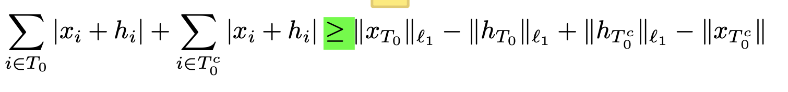

Again, similar to the previous subpart we can use the triangle inequality to prove this inequality
$$
\Sigma_{i \in T_0} |x_i + h_i| \geq \Sigma_{i \in T_0} |x_i| - \Sigma_{i \in T_0} |h_i| = ||x_{T_0}||_{l_1} - ||h_{T_0}||_{l_1}
$$
Similary for $||x_{T_0}||_{l_1} - ||h_{T_0}||_{l_1}$. 

From these inequalities we can conclude the required inequality.

**(7) Justify this inequality**

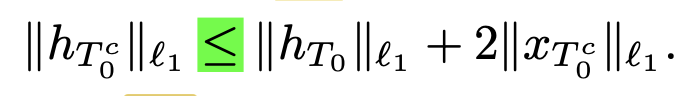

On rearranging the previous inequality and substituting $||x_{T_0^c}|| = ||x - x_s||_{l_1}$, we get
$$
||h_{T_0^c}||_{l_1} \leq ||h_{T_0}||_{l_1} + ||x_{T_0^c}||_{l_1} - ||x_{T_0}||_{l_1} + ||x||_{l_1}
$$
Using the triangle inequality,
$$
||h_{T_0^c}||_{l_1} \leq ||h_{T_0}||_{l_1} + 2||x_{T_0^c}||_{l_1}
$$
Hence proved

**(8) Justify**

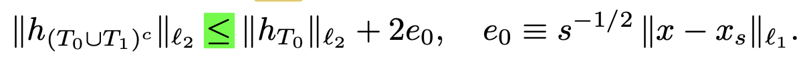

Applying (11, inequality in the paper), then the previous inequality and then triangle inequality ($||h_{T_0}||_{l_1} < \sqrt s ||h_{T_0}||_{l_2}$), we get
$$
||h_{(T_0 \cup T_1)^c}||_{l_2} \leq \sqrt s (||h_{T_0}||_{l_1} + 2||x_{T_0^c}||_{l_1})
$$
Using the triangle inequality mentioned above,
$$
||h_{(T_0 \cup T_1)^c}||_{l_2} \leq ||h_{T_0}||_{l_1} + 2 e_0
$$
where, $e_0 = s^{-1/2} ||x - x_s||_{l_1}$. Since, $||x_{T_0^c}||_{l_1} = ||x - x_s||_{l_1}$

**(9) Justify**

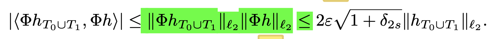

First part can be concluded by the Cauchy-Schwarz inequality i.e., dot product is less than product of the magnitudes

Also as proved in the previous subparts
$$
||\Phi h||_{l_2} = ||\Phi (x^* - x)||_{l_2} \leq 2 \epsilon
$$

$$
||\Phi h_{T_0 \cup T_1}||_{l_2} \leq \sqrt{1 + \delta_{2s}}||h_{T_0 \cup T_1}||_{l_2}
$$

Combining these inequalities, we will get the required inequality.

**(10) Justify this carefully. See Lemma 1 in this paper.**

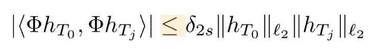

Lemma 2.1 in the paper directly states this where s = s, s' = s (given $T_0, T_j$ are s sparse)

**(11) Justify**

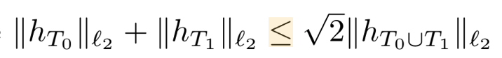

Since $T_0, T_1$ are disjoint, $h_{T_0 \cup T_1} = h_{T_0} + h_{T_1}$

say, $|h_{T_0}|_1 = a$ and $|h_{T_1}|_1 = b$,

Then the above inequality is $a + b \leq \sqrt 2 \sqrt{a^2 + b^2}$
$$
a^2 + b^2 - 2ab \geq 0\\
2(a^2 + b^2) \geq (a+b)^2\\
a+b \leq \sqrt{2(a^2 + b^2)}
$$
Hence, proved

**(12) Justify both inequalities carefully.**

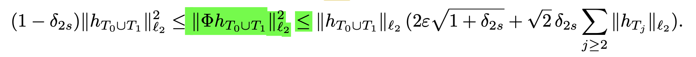

The left inequality is same as that of the RIP left equality ($h_{T_0 \cup T_1}$ is 2S-sparse)

For the right inequality,
$$
||\Phi h_{T_0 \cup T_1}||_2^2 = \langle\Phi h_{T_0 \cup T_1}, \Phi h\rangle - \langle\Phi h_{T_0 \cup T_1}, \Sigma_{j \geq 2} \Phi h_j\rangle
$$
Using ($a-b \leq |a| + |b|$)
$$
||\Phi h_{T_0 \cup T_1}||_2^2 = |\langle\Phi h_{T_0 \cup T_1}, \Phi h\rangle| + |\langle\Phi h_{T_0 \cup T_1}, \Sigma_{j \geq 2} \Phi h_j\rangle|
$$

From subpart 9 and statement in the paper,  we have 
$$
\langle\Phi h_{T_0 \cup T_1}, \Phi h\rangle \leq 2 \epsilon \sqrt{1+ \delta_{2s}}||h_{T_0 \cup T_1}||_{l_2}
$$

$$
|\langle\Phi h_{T_0 \cup T_1}, \Sigma_{j \geq 2} \Phi h_j\rangle| = \Sigma_{j \geq 2} |\langle\Phi h_{T_0 \cup T_1}, \Phi h_j\rangle|
$$

Using subpart 10, 11 and the fact that $T_0, T-1$ are disjoint, we get:
$$
\Sigma_{j \geq 2} |\langle\Phi h_{T_0 \cup T_1}, \Phi h_j\rangle| = \Sigma_{j \geq 2} \delta_{2s} ||h_{T_j}||_{l_2} (||h_{T_0}||_{l_2} + ||h_{T_1}||_{l_2})\\
= \Sigma_{j \geq 2}\   \sqrt 2 \delta_2 ||h_{T_j}||_{l_2} ||h_{T_0 \cup T_1}||_{l_2}
$$
Adding both these inequalities, we get the final right inequality.

**(13) Justify.**

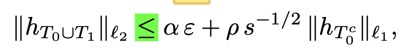

Dividing the previous inequality with $1 - \delta_{2S}$ will give the above Inequality

where, 

$\alpha = \frac{2 \sqrt{1 + \delta_{2S}}}{1-\delta_{2S}}$ and $\rho = \frac{\sqrt 2 \delta_{2S}}{1 - \delta_{2S}}$

**(14) Justify**

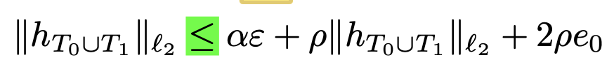

We will use these statements derived before:
$$
||h_{T_0}||_{l_1} \leq \sqrt 2 ||h_{T_0}||_{l_2}
$$

$$
||h_{T_0}||_{l_2} \leq ||h_{T_0 \cup T_1}||_{l_2}
$$

Substituting these in the inequality (13) in this report, we will get the required inequality.

**(15) Justify both inequalities in this line.**

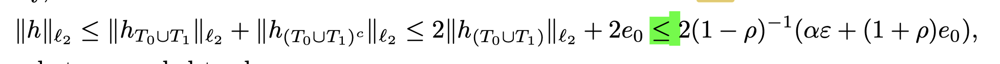

Left inequality is trivial as: $h = h_{(T_0 \cup T_1)} +h_{(T_0 \cup T_1)^c}$. Follwed by the triangle Inequality we will get the desired Inequality.

The Inequality in the middle can be derive directly from the eq 13 (in the paper) and the fact that $||h_{T_0}||_{l_2} \leq ||h_{T_0 \cup T_1}||_{l_2}$
$$
||h_{(T_0 \cup T_1)}||_{l_2} + ||h_{T_0 \cup T_1}||_{l_2} \leq 2||h_{T_0 \cup T_1}||_{l_2} + 2 e_0
$$
The rightmost Inequality can be derived by substituting $||h_{T_0 \cup T_1}||_{l_2} = (1-\rho)^{-1} (\alpha \varepsilon + 2\rho e_0)$

On adding $2e_0$ to the 2 times of the above equation will give the desired Inequality.

**(16) Justify this inequality** 

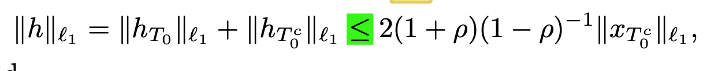

This is the direct conlusion of these statement in the paper:

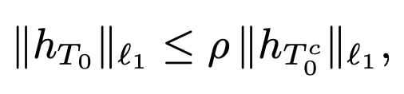

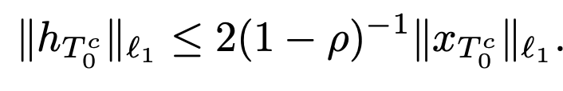

 Adding these two will give the desired inequality.

## Ques 2

RMSE : $norm(x'-x)/norm(x)$

- a) RMSE  = 

- b) RMSE = 

- c) RMSE = 

  

- d) RMSE = 0.7-0.9 

  The error is very high for the algorithm to work. The algorithm gives very bad results.

## Ques 2

RMSE : $norm(x'-x)/norm(x)$

- a) RMSE  = 0.0014

  

- b) RMSE = 0.1182

  $\lambda = 1$ gives images with very dark tone so I have canged it to 40.

  

- c) RMSE = 0.2991

  As it is taking too long with the function handles I have restricted iterations to 15.

  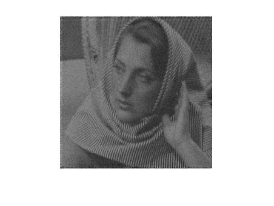

- d) RMSE = 0.7-0.9 

  The error is very high for the algorithm to work. The algorithm gives very bad results.

-----

## Ques 3

**(a)** $x$ is a purely sparse signal with the compressive measurements $y = \Phi x + \eta$, where $||\eta||_2 \leq \epsilon$. 

Let $\tilde x$ be the oracular solution and we know the indices of non-zero elements of signal x.

As defined in the question, take $\Phi_S$ a submatrix of $\Phi$ with those columns 0 which do not belong to set S.
$$
y = \Phi_s \tilde x\\
\Phi_S^T y = \Phi_S^T \Phi_S \tilde x
$$
It is given that the inverse of $\Phi_s^T \Phi_S$ exists, 
$$
\tilde x = (\Phi_S^T \Phi_S)^{-1} \Phi_S^T y\\
\tilde x = \Phi_S^\dagger y
$$
Where, $\Phi_S^\dagger$ is the pseudo-inverse of the submatrix $\Phi_S$

**(b)** Using the equation from subpart (a)
$$
||\tilde x - x||_2 = ||\Phi_S^\dagger y - x|| \\
= ||\Phi_s^\dagger (\Phi x + \eta) - x||
$$
Since x is purely sparse, it has atmost S non-zero elements, therefore $\Phi_S x = \Phi x$ (according to $\Phi_S$'s definition)
$$
||\Phi_s^\dagger (\Phi x + \eta) - x||
\\ = ||(\Phi_S^T \Phi_S)^{-1} \Phi_S^T \Phi x + \Phi_S^\dagger \eta - x||\\
= ||(\Phi_S^T \Phi_S)^{-1} \Phi_S^T \Phi_S x + \Phi_S^\dagger \eta - x||\\
= ||x + \Phi_S^\dagger \eta - x||\\
= ||\Phi_S^\dagger \eta|| 
$$
By Cauchy-Schwarz inequality,
$$
||\tilde x - x||_2 = ||\Phi_S^\dagger \eta||_2 \leq ||\Phi_S^\dagger||_2||\eta||_2
$$

**(c)** Largest singluar value of $\Phi_S^\dagger$ is $||\Phi_S^\dagger||_2$

Using RIP, 
$$
(1 - \delta_{2S})||\tilde x - x||^2_2 \leq ||\Phi (\tilde x - x)||_2^2 \leq (1 + \delta_{2S})||\tilde x - x||^2_2
$$
Using SVD:
$$
\Phi = U \Sigma V^*\\
\Phi^\dagger = (U \Sigma V^*)^\dagger\\
\Phi^\dagger = V \Sigma^\dagger U^*
$$
$\Sigma^\dagger$ is formed from $\Sigma$ by taking the reciprocal of all the non-zero elements, leaving all the zeros alone 

​																																		[- Ref.(Computing SVD and pseudoinverse)](https://www.johndcook.com/blog/2018/05/05/svd/)

Therfore,
$$
||\Phi_S||_2^{-2} = 1/||\Phi^\dagger_S||_2
$$

Using the RIP inequality,
$$
(1 - \delta_{2S})||\tilde x - x||^2_2 \leq ||\Phi (\tilde x - x)||_2^2 \leq (1 + \delta_{2S})||\tilde x - x||^2_2\\
(1 - \delta_{2S}) \leq \frac{||\Phi (\tilde x - x)||_2^2}{||\tilde x - x||^2_2} \leq (1+\delta_{2S})\\
(1 - \delta_{2S}) \leq ||\Phi_S||_2^{-2} \leq (1 + \delta_{2S})\\
\frac{1}{\sqrt{1 + \delta_{2S}}}\leq ||\Phi_S^\dagger||_2 \leq \frac{1}{\sqrt{1-\delta_{2S}}}\\
$$

**(d)** 
$$
||\tilde x - x||_2^2 = \frac{||\Phi_S^\dagger \eta||_2^2}{||\eta||_2^2} ||\eta||_2^2 \\
$$
From the previous derivation, we know that, 
$$
(1 - \delta_{2S})||\tilde x - x||^2_2 \leq ||\eta||_2^2 \leq (1 + \delta_{2S})||\tilde x - x||^2_2
$$
Also, $||\eta||_2 \leq \epsilon$ , 
$$
||\tilde x - x||_2 \leq \frac{\epsilon}{\sqrt{1 - \delta_{2S}}}
$$

$$
||\tilde x - x||_2 \geq \frac{\epsilon}{\sqrt{1 + \delta_{2S}}}
$$

Now, let $x^*$ be the solution given by theorem 3: $||y - \Phi x^*|| \leq \epsilon$

From the above mentioned inequality, 
$$
\epsilon \leq (\sqrt{1+\delta_{2S}}) ||x - \tilde x||_2
$$
Therefore,
$$
||y - \Phi x^*|| \leq \epsilon \leq (\sqrt{1+\delta_{2S}}) ||x - \tilde x||_2\\
||\Phi (x- x^*)|| \leq (\sqrt{1+\delta_{2S}}) ||x - \tilde x||_2\\
$$
But, 
$$
\sqrt{(1 - \delta_{2S})}||x - x^*||_2 \leq ||\Phi (x - x^*)||_2
$$
Combining these, we get:
$$
||x - x^*||_2 \leq c ||x-\tilde x||_2
$$
where, $c = \sqrt\frac{1+\delta_{2S}}{1-\delta_{2S}}$

Hence the solution given by Theorem 3 is only a constant factor worse than this solution.

##  Ques 4

We Have:

- $\delta_{S}$ = $\max\{1-\lambda_{\min},\lambda_{\max}-1\}$
- $\lambda_{\max}$ = $\max_{\theta_{\tau}\epsilon\R^{S},|\tau|\le S}\frac{||A_{\tau}\theta_{\tau}||^2}{||\theta_{\tau}||^2}$ 
- $\lambda_{\min}$ = $\min_{\theta_{\tau}\epsilon\R^{S},|\tau|\le S}\frac{||A_{\tau}\theta_{\tau}||^2}{||\theta_{\tau}||^2}$

As $S\lt T$ ;
$$
|\tau| \le T \text{ can be divided as } \tau' \text{ and } \tau'' \text{ such that }\\
|\tau'| \le S \text{ and } S \lt |\tau''| \le T
$$

$$
\lambda_{S\max} = \max_{\theta_{\tau}\epsilon\R^{S},|\tau|\le S}\frac{||A_{\tau}\theta_{\tau}||^2}{||\theta_{\tau}||^2} \text{ , }
\lambda_{T\max} = \max_{\theta_{\tau}\epsilon\R^{T},|\tau|\le T}\frac{||A_{\tau}\theta_{\tau}||^2}{||\theta_{\tau}||^2}\\
$$

- 

$$
\max_{\theta_{\tau}\epsilon\R^{T},|\tau|\le T}\frac{||A_{\tau}\theta_{\tau}||^2}{||\theta_{\tau}||^2} = \max(\max_{\theta_{\tau}\epsilon\R^{T},|\tau|\le S}\frac{||A_{\tau}\theta_{\tau}||^2}{||\theta_{\tau}||^2}, \max_{\theta_{\tau}\epsilon\R^{T},S \lt |\tau|\le T}\frac{||A_{\tau}\theta_{\tau}||^2}{||\theta_{\tau}||^2})\\
= \max(\max_{\theta_{\tau}\epsilon\R^{S},|\tau|\le S}\frac{||A_{\tau}\theta_{\tau}||^2}{||\theta_{\tau}||^2}, \max_{\theta_{\tau}\epsilon\R^{T},S \lt |\tau|\le T}\frac{||A_{\tau}\theta_{\tau}||^2}{||\theta_{\tau}||^2})\\
= \max(\lambda_{S \max}, \max_{\theta_{\tau}\epsilon\R^{T},S \lt |\tau|\le T}\frac{||A_{\tau}\theta_{\tau}||^2}{||\theta_{\tau}||^2})\\
\Rightarrow \lambda_{T \max} \ge \lambda_{S \max}\\
\Rightarrow \lambda_{T \max}-1 \ge \lambda_{S \max}-1
$$

- 

$$
\min_{\theta_{\tau}\epsilon\R^{T},|\tau|\le T}\frac{||A_{\tau}\theta_{\tau}||^2}{||\theta_{\tau}||^2} = \min(\min_{\theta_{\tau}\epsilon\R^{S},|\tau|\le S}\frac{||A_{\tau}\theta_{\tau}||^2}{||\theta_{\tau}||^2}, \min_{\theta_{\tau}\epsilon\R^{T},S \lt |\tau|\le T}\frac{||A_{\tau}\theta_{\tau}||^2}{||\theta_{\tau}||^2})\\
= \min(\lambda_{S \min}, \min_{\theta_{\tau}\epsilon\R^{T},S \lt |\tau|\le T}\frac{||A_{\tau}\theta_{\tau}||^2}{||\theta_{\tau}||^2})\\
\Rightarrow \lambda_{T \min} \le \lambda_{S \min}\\
\Rightarrow 1-\lambda_{T \min} \ge 1-\lambda_{S \min}
$$

Case 1  

$\lambda_{T \max}-1\ge 1-\lambda_{T \min}$:

As $\lambda_{T \max}-1 \ge \lambda_{S \max}-1$ and $\lambda_{T \max}-1\ge 1-\lambda_{T \min} \ge 1-\lambda_{S \min}$

 $\max\{\lambda_{T \max}-1,1-\lambda_{T \min}\}\ge\max\{\lambda_{S \max}-1,1-\lambda_{S \min}\}$

$\delta_T\ge\delta_S$

Case 2 

 $1-\lambda_{T \min}\ge\lambda_{T \max}-1$:

As $1-\lambda_{T \min}\ge\lambda_{T \max}-1 \ge \lambda_{S \max}-1$ and $1-\lambda_{T \min} \ge 1-\lambda_{S \min}$

$\max\{\lambda_{T \max}-1,1-\lambda_{T \min}\}\ge\max\{\lambda_{S \max}-1,1-\lambda_{S \min}\}$

$\delta_T\ge\delta_S$

$\therefore \delta_T\ge\delta_S$

## Ques 5

- **[Error Correction Codes for COVID-19 Virus and Antibody Testing: Using Pooled Testing to Increase Test Reliability](https://arxiv.org/pdf/2007.14919.pdf)**

  

- **Key Objective Function:** 

  > ​		minimize $||z||_1 + \lambda||{\bf y-Az-u}||_1,$
  >
  > ​		subject to $||{\bf u}||_2 \le \epsilon,$
  >
  > ​								$z \ge 0,$

   where $||z||_1$ is the sum of absolute value of all the elements of z

  $\lambda \in \R $ is a tuning parameter for controlling the tradeoff between  $||z||_1$ & $||{\bf Az - y-u}||_1$

  $\epsilon \ge 0$ is a parameter controlling the tolerance for noise, $x \ge 0$ means that every element of x is nonnegative

  $||{\bf u}||_2$ is the $l_2$ norm of $\bf u$ 

  

  Assume that we can get $n$ samples for $n$ subjects with one sample for each, and we will perform $m$ tests to determine the quantities of COVID-19 viruses in these samples.

  > ${\bf x} \in [0,\infty)^n$ : The quantity of the DNA that can be generated from the subjects' viral RNAs
  >
  > ${\bf P} \in \{0,1\}^{m\times n}$: matrix to denote participation of $n$ samples in $m$ tests ($P_{ij} = 1$ if $j^{th}$ sample took part in $i^{th}$ test, else $P_{ij}=0$ )
  >
  > ${\bf W} \in [0,1]^{m \times n}$: $W_{ij}$ is the fraction of the $j^{th}$ sample used in the $i^{th}$ test.
  >
  > $\bf A := P \circ W$:  our measurement matrix where $\circ$ represents Hadamard multiplication. 

  

  The corresponding $m$ mixed samples will go through $m$ quantitative PCR to quantify amount of DNAs. Due to potential background noises and gross errors caused by factors such as dilutions, sample and reagent contamination, and operation mistakes, the final measurements ${\bf y} \in \R^m$ from the real-time PCR can be modeled as

  > $\bf y = Ax + e + v$
  >
  > ${\bf Ax} \in \R^m$: True signal
  >
  > ${\bf v} \in \R^m$: Observation noise
  >
  > ${\bf e} \in \R^m$: possible gross error

  Our goal is to recover ${\bf x} \in [0, \infty)^n$ which is what is achieved by our Key Objective Function

  where $\bf z$ is an estimate of $\bf x$, $\bf u$ is an estimate of $\bf v$, and $\bf y-Az-u$ is an estimate of $\bf e$.

- - The main purpose of error correcting pooled testing is to increase test reliability, not to reduce required test numbers as in tapestry pooling.
  - In error detection codes using pooled testing, it doesn't require the involved signal to be sparse as what we consider in tapestry pooling: the signal can be fully dense in the proposed strategy.
  - The intuition behind tapestry is that the current rate of COVID-19 infections in the world population means that most samples tested are not infected, so most tests are wasted on uninfected samples. So tapestry uses this redundancy by group pooling to save on testing resources.
  - The intuition behnd the proposed strategy is that when each individual's sample is part of many pooled sample mixtures, the test results from all of the sample mixtures contain redundant information about each individual's diagnosis, which can be exploited to automatically correct for wrong test results in exactly the same way that error correction codes correct errors introduced in noisy communication channels.
  - Tapestry uses a two-stage approach. In the first stage all the negative pools are identified and the comprising samples are ruled out for the next step. In the second stage compressive sensing is applied to decrease false positives and estimate respective viral loads.
  - The proposed approach uses compressive sensing by assuming the gross error is sparse to estimate viral loads in any regime (undersampled or oversampled) without increasing number of tests required. So it is single stage.

-----

## Ques 6

- P1:  $\min_x||x||_1$ s. t. $||y=\phi x||_2 \le \epsilon$ 

- LASSO: $\min_x (||y-\phi x||_2^2 + \lambda||x||_1)$ 

Let's take $\epsilon = ||y-\phi x||_2$  where x is solution to LASSO problem

Let's suppose $x'$ is the solution to P1 problem.

So,

$||y-\phi x'||_2 \le ||y-\phi x||_2$ 

$||y-\phi x'||_2^2 \le ||y-\phi x||_2^2$                       						(As both are positive)

$||y-\phi x'||_2^2 + \lambda||x'||_1 \ge ||y-\phi x||_2^2 + \lambda||x||_1$ 		   (As x is a minimizer to LASSO)

$ \lambda(||x'||_1 - ||x||_1) \ge ||y-\phi x||_2^2 - ||y-\phi x'||_2^2 $

$ \lambda(||x'||_1 - ||x||_1) \ge 0 $

$||x'||_1\ge||x||_1$ 																   (As $\lambda$ is positive)

$||x'||_1=||x||_1$ 																   (As $x'$ is a minimizer of P1 and x also satisfies 																								P1's contraint $||y-\phi x||_2 \le \epsilon$)

This implies $x$ is also a minimizer of the problem P1. 

We have proved that for this $\epsilon$ it, indeed, is possible.

Therefore, there exists some value of $\epsilon$ for which minimizer of LASSO is also a minimizer of P1.

-----

