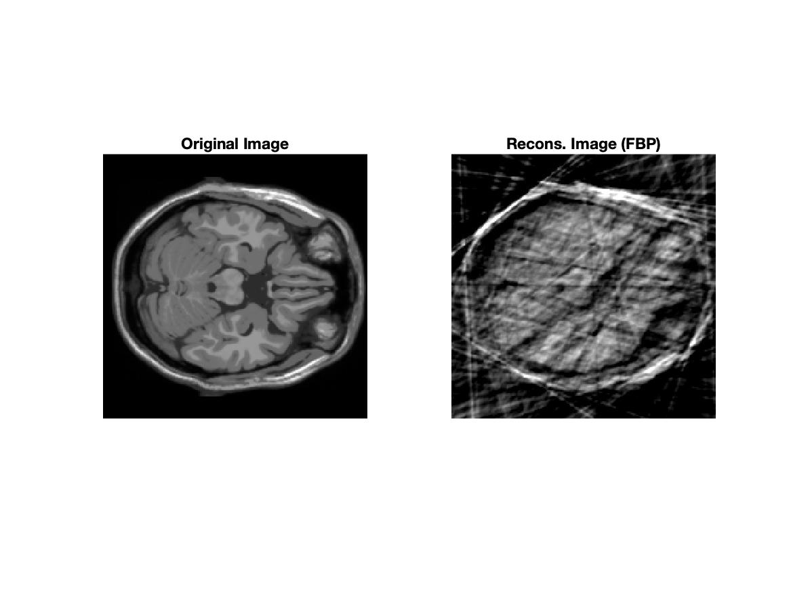
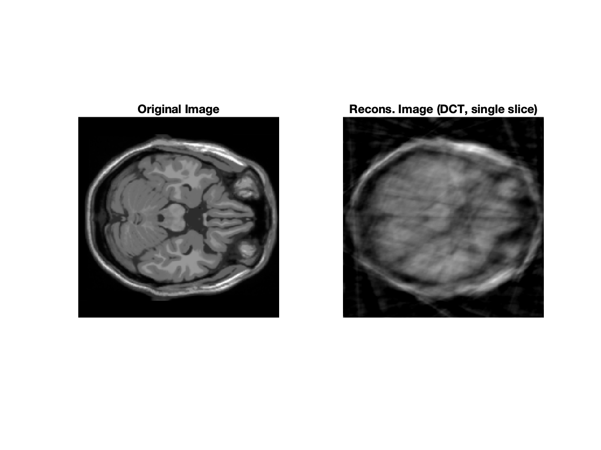
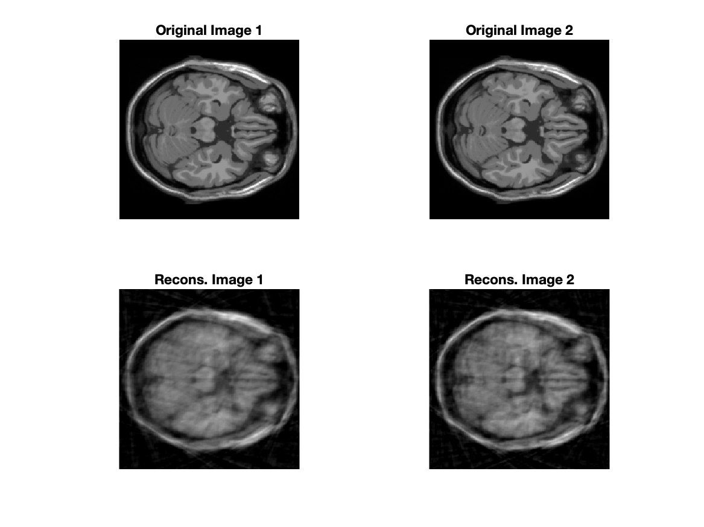
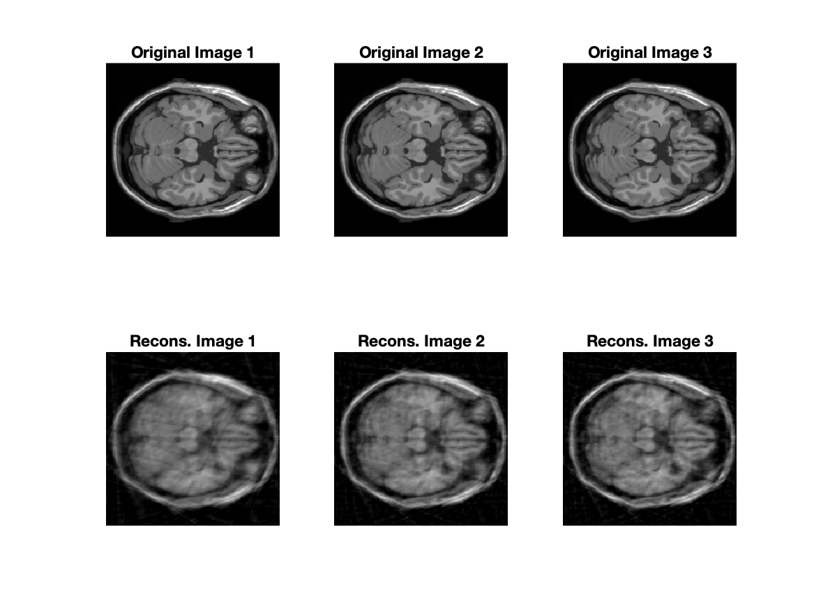

# HW 3 - CS754

#### Sahasra Ranjan - 190050102

#### Rahul Prajapat - <roll>

### Q1

### Q2

**Filtered Back Projection using the Ram-Lak filter**

​			Fig 1. Reconstruction using  filtered back projection using the Ram-Lak filter

**Compression Sensing reconstruction (single slice)**

​			Fig 2. Reconstruction using Compressed Sensing on a single slice (2D-DCT basis).

**Reconstruction using tow consecutive slices**
$$
E(\beta_1, \beta_2) = \begin{Vmatrix}
\begin{pmatrix}
y_1\\
y_2
\end{pmatrix}
-
\begin{pmatrix}
R_1U & 0\\
R_2U & R_2U
\end{pmatrix}
\begin{pmatrix}
\beta_1\\
\Delta \beta_{21}
\end{pmatrix}
\end{Vmatrix}^2

+ \lambda
\begin{Vmatrix}
\beta_1\\
\Delta \beta_{21}
\end{Vmatrix}_1
$$

​				Fig 3. Reconstruction using CS on two consecutive slices (2D-DCT basis).

**Reconstruction using three consecutive slices**

$$
E(\beta_1, \beta_2, \beta_3) = ||y_1 - R_1 U \beta_1||^2 + ||y_2 - R_2 U \beta_2||^2 + ||y_3 - R_3 U \beta_3||^2 \\ + \lambda (||\beta_1||_1 + ||\beta_2 - \beta_1||_1 + ||\beta_3 - \beta_2||_1)\\
$$

$$
= ||y_1 - R_1 U \beta_1||^2 + ||y_2 - R_2 U (\beta_1 + \Delta\beta_{21})||^2 + ||y_3 - R_3 U (\beta_1 + \Delta\beta_{21} + \Delta \beta_{32})||^2 \\
+ \lambda (||\beta_1||_1 + ||\Delta \beta_{21}||_1 + ||\Delta \beta_{32}||_1)
$$

Final expression for reconstruction using 3 consecutive slices:
$$
E(\beta_1, \beta_2, \beta_3) = \begin{Vmatrix}
\begin{pmatrix}
y_1\\
y_2\\
y_3
\end{pmatrix}
-
\begin{pmatrix}
R_1U & 0 & 0\\
R_2U & R_2U & 0\\
R_3U & R_3U & R_3U
\end{pmatrix}
\begin{pmatrix}
\beta_1\\
\Delta \beta_{21}\\
\Delta \beta_{32}
\end{pmatrix}
\end{Vmatrix}^2

+ \lambda
\begin{Vmatrix}
\beta_1\\
\Delta \beta_{21}\\
\Delta \beta_{32}
\end{Vmatrix}_1
$$

​				Fig 4. Reconstruction using CS on three consecutive slices (2D-DCT basis).

### Q3

**(a) Shifting :**
$$
R(g(x,y))(\rho,\theta) = \int_{-\infty}^{\infty} \int_{-\infty}^{\infty} g(x,y) \delta(x \cos \theta + y \sin \theta -\rho) dx dy\\
R(g(x-x_0,y-y_0))(\rho,\theta) = \int_{-\infty}^{\infty}\int_{-\infty}^{\infty} g(x-x_0,y-y_0) \delta(x \cos \theta + y \sin \theta - \rho) dx dy
$$
With change of variable ($p = x-x_0, q = y-y_0$):
$$
R(g(x',y'))(\rho,\theta) = \int_{-\infty}^{\infty}\int_{-\infty}^{\infty} g(x',y') \delta((x'+x_0) \cos \theta + (y'+y_0) \sin \theta - \rho) dx' dy'\\
= \int_{-\infty}^{\infty}\int_{-\infty}^{\infty}  g(x',y') \delta(x' \cos \theta + y' \cos \theta - (\rho - x_0 \cos \theta - y_o \sin \theta)) dx' dy'\\
= R(g(x,y))(\rho-x_0 \cos \theta - y_0 \cos \theta,\theta)
$$

**(b) Rotation :**
$$
g'(r,\psi) = g(r,\psi - \psi_0)
$$
The graph represented by $g$ is rotated by an angle $\psi_0$.

Polar equation of line $x \cos \theta + y \sin \theta = \rho$ will be $r \cos \theta \cos \psi + r \sin \theta \sin \psi - \rho$. 
$$
r \cos \theta \cos \psi + r \sin \theta \sin \psi - \rho\\

= r cos(\theta - \psi) - \rho
$$
Using these in the Radon transform, we get:

$$
R(g')(\rho, \theta) = \int_{-\infty}^{\infty} \int_{0}^{2 \pi} g'(r,\psi) \delta(r \cos (\theta - \psi) -\rho) d\psi dr\\

= \int_{-\infty}^{\infty} \int_{0}^{2 \pi} g(r,\psi-\psi_0) \delta(r \cos (\theta - \psi) -\rho) d\psi dr\\
$$
With change of variable ($\psi' = \psi-\psi_0$), we get:
$$
R(g')(\rho,\theta) = \int_{-\infty}^{\infty} \int_{0}^{2 \pi} g(r,\psi') \delta(r \cos (\theta - (\phi' + \psi_0)) -\rho) d\psi' dr\\

= R(g)(\rho, \psi_0 - \theta)
$$

**(c) Convolution :**
$$
(f*k)(x,y) := \int_{-\infty}^{\infty}\int_{-\infty}^{\infty} f(x-\tau,y-\varphi) k(\tau,\varphi) d\tau d\varphi
$$

$$
LHS = R_\theta (f * k) (\rho) \\
= \int_{-\infty}^{\infty}\int_{-\infty}^{\infty}\int_{-\infty}^{\infty} f(x-\tau,y-\varphi) k(\tau,\varphi) \delta(x \cos \theta + y \sin \theta - \rho) d\tau d\varphi d\rho\\
$$

$$
RHS = R_\theta(f) * R_\theta(k)\\

= \int_{-\infty}^{\infty} R_\theta(f) (\rho - \varrho) R_\theta(k)(\varrho) d\varrho \\
$$
Since, 
$$
\int_{-\infty}^{\infty} \int_{-\infty}^{\infty} \delta(a - \rho + \varrho) \delta(a - \varrho) d\rho d\varrho 
= \int_{-\infty}^{\infty} \delta (a - \rho) d\rho
$$
And, we can represent $f(x',y')$ as $f(x-\tau, y-\varphi)$ to have same integral (both from $-\infty \to \infty$). We get,
$$
\int_{-\infty}^{\infty} R_\theta(f) (\rho - \varrho) R_\theta(k)(\varrho) d\varrho \\

= \int_{-\infty}^{\infty} \int_{-\infty}^{\infty} \int_{-\infty}^{\infty} f(x-\tau,y-\varphi) k(\tau,\varphi) \delta(x \cos \theta + y \sin \theta - \rho) d\tau d\varphi d\rho \\

\therefore LHS = RHS
$$

### Q4

