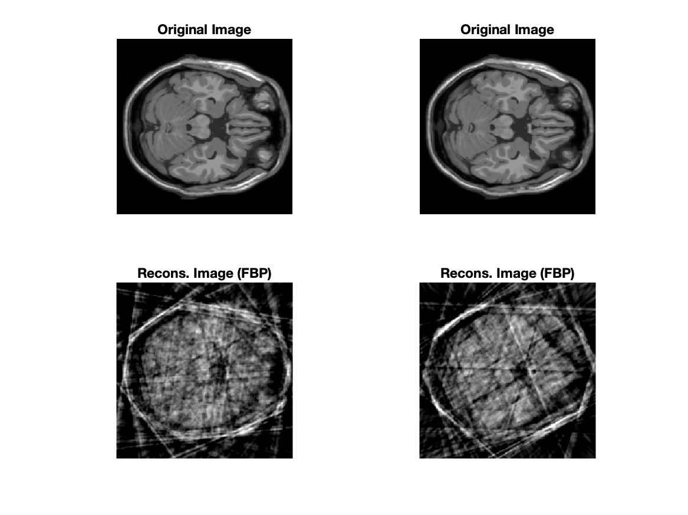
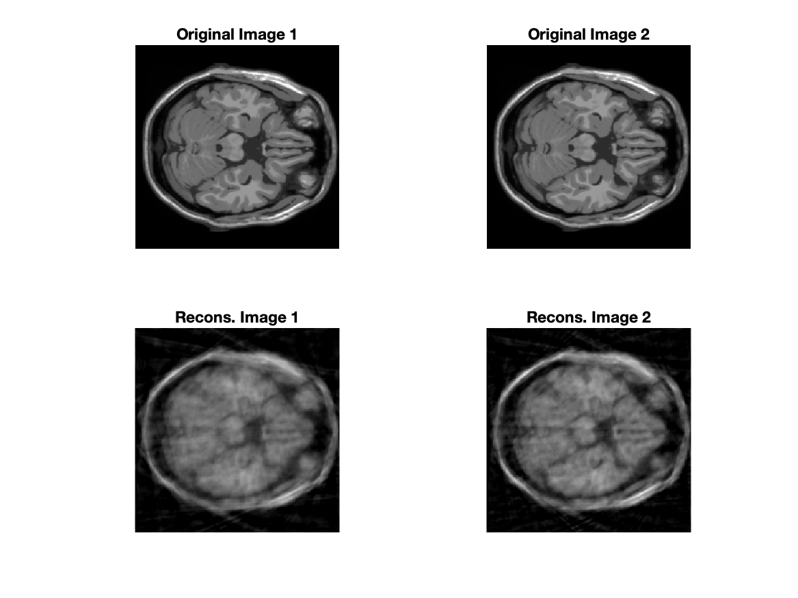

# HW 3 - CS754

#### Sahasra Ranjan - 190050102

#### Rahul Prajapat - <roll>

### Q2

$$
E(\beta_1, \beta_2, \beta_3) = ||y_1 - R_1 U \beta_1||^2 + ||y_2 - R_2 U \beta_2||^2 + ||y_3 - R_3 U \beta_3||^2 \\ + \lambda (||\beta_1||_1 + ||\beta_2 - \beta_1||_1 + ||\beta_3 - \beta_2||_1)\\
$$

$$
= ||y_1 - R_1 U \beta_1||^2 + ||y_2 - R_2 U (\beta_1 + \Delta\beta_{21})||^2 + ||y_3 - R_3 U (\beta_1 + \Delta\beta_{21} + \Delta \beta_{32})||^2 \\
+ \lambda (||\beta_1||_1 + ||\Delta \beta_{21}||_1 + ||\Delta \beta_{32}||_1)
$$

Final expression for reconstruction using 3 consecutive slices:
$$
E(\beta_1, \beta_2, \beta_3) = \begin{Vmatrix}
\begin{pmatrix}
y_1\\
y_2\\
y_3
\end{pmatrix}
-
\begin{pmatrix}
R_1U & 0 & 0\\
R_2U & R_2U & 0\\
R_3U & R_3U & R_3U
\end{pmatrix}
\begin{pmatrix}
\beta_1\\
\Delta \beta_{21}\\
\Delta \beta_{32}
\end{pmatrix}
\end{Vmatrix}^2

+ \lambda
\begin{Vmatrix}
\beta_1\\
\Delta \beta_{21}\\
\Delta \beta_{32}
\end{Vmatrix}
$$

