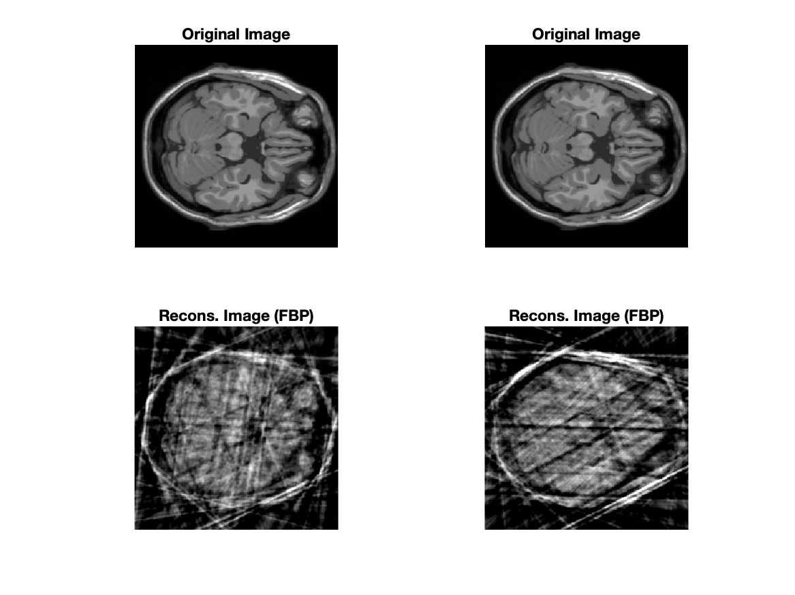

# HW 3 - CS754

#### Sahasra Ranjan - 190050102

#### Rahul Prajapat - 190050095

### Q1

**a) Define the restricted eigenvalue condition**

$X: \R^{N\times p}$ and $N < p,$ then $X^TX$'s rank would be at most N so some eigenvalues would be zero 
	
For a function to be strongly convex at $\beta^*$, $\frac{v^T\nabla^2f(\beta)v}{||v||_2^2} \ge \gamma \text{, for all nonzero } v\in \R^p, \text{ for all } \beta \text{ in the neighbourhood of } \beta^*$
	
But as our cost function's second derivative is $\frac{X^TX}{N}$ so it is not strongly convex, but it is strongly convex in some subspace.
	
So our restricted eigenvalue condition states: $\frac{v^TX^TXv}{N||v||_2^2} \ge \gamma \text{, for all nonzero } v\in C,\text{ for some } C \sub \R^p$

**b) Why is ** $\bf G(\hat v) \le G(0)$ 
$$
G(v) = \frac{1}{2N}||y-X(\beta^*+v)||_2^2 + \lambda_N ||\beta^*+ v||_1\\
G(\hat v) = \frac{1}{2N}||y-X(\beta^*+\hat\beta-\beta^*)||_2^2 + \lambda_N ||\beta^*+\hat\beta-\beta^*||_1\\
=\frac{1}{2N}||y-X(\hat\beta)||_2^2 + \lambda_N ||\hat\beta||_1 = J(\hat\beta)\\
G(0) = \frac{1}{2N}||y-X(\beta^*)||_2^2 + \lambda_N ||\beta^*||_1 = J(\beta^*)\\
J(\hat\beta) \le J(\beta^*) \text{, as } \hat\beta \text{ is a minimizer of J}\\
\therefore G(\hat v) \le G(0)
$$

**c) Do the algebra to obtain equation 11.21**

​	$G(\hat{v}) \le G(0)$ 
$$
y = { X \beta^*} + w\\
||y-X\beta^*||_2^2 = ||w||_2^2\\
||y-X(\beta^*+\hat v)||_2^2 = ||w-X\hat v||_2^2 = (w-X\hat v)^T(w-X\hat v)\\
= w^Tw+(\hat vX)^TX\hat v - w^TX\hat v - (X\hat v)^Tw \\
= ||w||_2^2 + ||X\hat v||_2^2 - 2w^TX\hat v \space\space	(\text{since all are scalars and scalar^T = scalar})
$$

$$
\frac{1}{2N}||y-X(\beta^*+\hat v)||_2^2 + \lambda_N||\beta^*+\hat v||_1 \le \frac{1}{2N}||y-X\beta^*||_2^2 + \lambda_N||\beta^*||_1 \\
\frac{1}{2N}(||w||_2^2+||X\hat v||_2^2-2w^TX\hat v) \le \frac{||w||_2^2}{2N} + \lambda_N(||\beta^*||_1-||\beta^*+\hat v||_1) \\
\frac{||X\hat v||_2^2}{2N} \le \frac{w^TX\hat v}{N} + \lambda_N(||\beta^*||_1-||\beta^*+v||_1)
$$

**d) Do the algebra in more detail to obtain equation 11.22**

$\beta$ is S sparse and the positions of non-zero elements are denoted by set $s$, $s^*$ is complement of $s$.
	
For any vector $u$ of same dimensions as that of $\beta$ then $u_s$ is the vector obtained by making the elements zero at position $p \in s^*$ .
	
As $\beta_s^*=0$, $||\beta||_1=||\beta_s||_1$
	
$||\beta^* + \hat v||_1 = ||\beta^*_s + \hat v_s||_1 + ||v_{s^*}||_1$ 
	
By triangular inequality, $||u-v||_1\ge ||u||_1-||v||_1$ , as $||u||_1=\sum|u_i|$ and $|x-y|\ge|x|-|y|$, 
	
therefore, $\sum|u_i-v_i|\ge\sum|u_i|-\sum|v_i|$
	
$||\beta^*_s - (-\hat v_s)||_1 \ge ||\beta^*_s||_1-||-\hat v_s||_1 = ||\beta^*_s||_1-||\hat v_s||_1$
	
So, $||\beta^*_s + \hat v_s)||_1 + ||v_{s^*}||_1 \ge ||\beta^*_s||_1-||\hat v_s||_1 + ||v_{s^*}||_1$
	
$-||\beta^* + \hat v||_1 \le -||\beta^*_s||_1+||\hat v_s||_1 - ||v_{s^*}||_1$
	
Applying this to 11.21,
	
$\frac{||X\hat v||_2^2}{2N} \le \frac{w^TX\hat v}{N} + \lambda_N(||\beta^*||_1 -||\beta^*_s||_1+||\hat v_s||_1 - ||v_{s^*}||_1)$
	
$\frac{||X\hat v||_2^2}{2N} \le \frac{w^TX\hat v}{N} + \lambda_N(||\hat v_s||_1 - ||v_{s^*}||_1)$

> Holder's inequality states $||fog||_1 \le ||f||_p||g||_q$ , given $p,q\in [1,\infty)$ and $1/p+1/q=1$
>
> So, $||AB||_1 = ||<A^T,B>||_1 \le ||A^T||_p||B||_q$, given $p,q\in [1,\infty)$ and $1/p+1/q=1$

$w^TX\hat v$ is a scalar so $w^TX\hat v=||w^TX\hat v||_1$
	
Here $f=(w^TX)^T=X^Tw,$ $g=\hat v,$ $p\rightarrow\infty,$ and $q=1$
	
So, $w^TX\hat v \le ||X^Tw||_\infty||\hat v||_1$
	
Hence, $\frac{||X\hat v||_2^2}{2N} \le \frac{||X^Tw||_\infty}{N}||\hat v||_1 + \lambda_N(||\hat v_s||_1 - ||v_{s^*}||_1)$

**e) Derive equation 11.23**

We'll take $\frac{1}{N}||X^Tw||_\infty\le\frac{\lambda_N}{2}$
$$
\frac{||X\hat v||_2^2}{2N} \le \frac{\lambda_N}{2}||\hat v||_1 + \lambda_N(||\hat v_s||_1 - ||v_{s^*}||_1)\\
\le \frac{\lambda_N}{2}(||\hat v_s||_1+||\hat v_{s^*}||_1) + \lambda_N(||\hat v_s||_1 - ||v_{s^*}||_1)\\
\le \frac{3\lambda_N}{2}||\hat v_s||_1 - \frac{\lambda_N||v_{s^*}||_1}{2}\\
\le \frac{3\lambda_N}{2}||\hat v_s||_1 \space \space \, \text{(as the second term with negative sign is positive)}
$$

> Cauchy Schwartz Inequality : $||v.w||_1 \le ||v||_2||w||_2$
>
> $v=v.I$
>
> $||vI||_1 \le ||v||_2||I||_2 = \sqrt{n}||v||_2$
>
> If $v$ is k-sparse then $v=v.S$ where $S$ is $I$ with $I_{i,i}=0\text{ if }v_i=0$ 
>
> $||S||_2=\sqrt{k}$
>
> So, $||v||_1\le\sqrt{k}||v||_2$ if $v$ is k-sparse

$$
\frac{||X\hat v||_2^2}{2N} \le \frac{3\lambda_N}{2}||\hat v_s||_1 \le \frac{3\lambda_N\sqrt{k}}{2}||\hat v_s||_2 \le \frac{3\lambda_N\sqrt{k}}{2}||\hat v||_2 \,\,\text{ as } ||v||_2 \ge ||v_s||_2\\
\frac{||X\hat v||_2^2}{2N} \le \frac{3\lambda_N\sqrt{k}}{2}||\hat v||_2 
$$

**f) Complete the proof assuming Lemma 11.1 to be true**

Assuming lemma 1 to be true, we can apply restricted eigenvalue condition
$$
\frac{1}{N}\frac{||X\hat v||_2^2}{||\hat v||_2^2} \ge \gamma \text{, where}\, \, \gamma \text{ is a positive constant, (as } v^TX^TXv=||Xv||_2^2)\\
\frac{1}{N}||X\hat v||_2^2 \ge \gamma||\hat v||_2^2\\
\frac{\gamma||\hat v||_2^2}{2} \le \frac{3}{2}\lambda_N\sqrt{k}||\hat v||_2 \text{, by 11.23}\\
||\hat v||_2 \le \frac{3}{\gamma}\lambda_N\sqrt{k}\\
||\hat \beta - \beta^*||_2 \le \frac{3}{\gamma}\lambda_N\sqrt{k} \text{, equation 11.14b}
$$

**g) Where does bound on** $\bf{\lambda_N}$ **show up**

While deriving 11.23 we took $\lambda_N\ge\frac{2}{N}||X^Tw||_\infty,$ we assumed it to introduce conic constraint in $\hat v,$ so as to apply $\gamma$-RE condition .

**h) Why is cone constraint required**

Cone constraint gives the $\gamma$-RE condition, using which we bounded the the LASSO L2-error. Without $\gamma$-RE error couldn't be bound so no guarantees of the estimator. We need the $\gamma$-RE condition so we require the cone constraint.

**i) This Theorem v/s Theorem 3**

- Theorem 3 uses Restricted Isometry Property, whereas this theorem uses Restricted Eigenvalue Conditon.
- In both the theorems sensing matrix doesn't need to be orthonormal.
- Both theorems handle noisy measurements.
- Theorem 3 give bounds for compressible signals ( signals in which some values are very-very smaller than others ), while this theorem only considers sparse signals.
-  Restricted Eigenvalue Condition is less restrictive than the Restricted Isometry Property, so this theorem requires weaker assumptions than Theorem 3.
-  This theorem has $\frac{k}{N}$ term in it's bound which gives it an intuitive edge (also it uses strong convexity which is more intuitive in comparison to RIP),  while theorem 3 doesn't have any say about it in it's bound.

**j) What is the common thread between the bounds on the ‘Dantzig selector’ and the LASSO?**

- Both set lower bound of parameters in terms of $||X^Tw||_\infty;$ $\text{Dantzig: } \lambda \ge ||X^Tw||_\infty, \text{ Lasso: } \lambda_N \ge \frac{2}{N}||X^Tw||_\infty$.
- In the case when $\hat \beta \in \sum_k,$ so that $\sigma_k(\hat\beta)_1=0;$$\text{Dantzig: } ||\hat v||_2 \le C_1\sqrt{k}\lambda, \text{ Lasso: } ||\hat v||_2 \le \frac{C_2}{\gamma}\sqrt{k}\lambda_N ,$ Both of them has the parameter and $\sqrt{k}$ in there bounds.
- When adapting both the theorems to Gaussian noise model, the bounds on $||\hat v||_2$ have $\sqrt{k\text{ log}(p)}$ term.

**k) What is the advantage of the square-root LASSO over the LASSO?**

- The lasso construction relies on knowing the standard deviation $\sigma$ of the noise.
- The square-root lasso eliminates the need to know or pre-estimate $\sigma$.
- Despite taking the square-root of the least squares criterion function, the problem retains global convexity making the estimator computationally feasible.
- This method also doesn't rely on normality or sub-Gaussianity of noise.
- It matches the performance of lasso with known $\sigma$ , i.e., achieving near-oracle performance.

### Q2

For this, we took k=18 random samples for each image using the function `randsample`. For the first part, we using `radon` and `iradon` functions. And for the later subparts, implemented function handles to get $A, A^T$ to pass in the `l1_ls` function provided in the hw folder. The reconstructions for (k=18) are provided here and for (k=60) are added in the images folder (`/images/k60`). 

**Filtered Back Projection using the Ram-Lak filter**

​										Fig 1. Reconstruction using  filtered back projection using the Ram-Lak filter

**Compression Sensing reconstruction (single slice)**

​										Fig 2. Reconstruction using Compressed Sensing on a single slice (2D-DCT basis).

**Reconstruction using tow consecutive slices**
$$
E(\beta_1, \beta_2) = \begin{Vmatrix}
\begin{pmatrix}
y_1\\
y_2
\end{pmatrix}
-
\begin{pmatrix}
R_1U & 0\\
R_2U & R_2U
\end{pmatrix}
\begin{pmatrix}
\beta_1\\
\Delta \beta_{21}
\end{pmatrix}
\end{Vmatrix}^2

+ \lambda
\begin{Vmatrix}
\beta_1\\
\Delta \beta_{21}
\end{Vmatrix}_1
$$

​											Fig 3. Reconstruction using CS on two consecutive slices (2D-DCT basis).

**Reconstruction using three consecutive slices**

$$
E(\beta_1, \beta_2, \beta_3) = ||y_1 - R_1 U \beta_1||^2 + ||y_2 - R_2 U \beta_2||^2 + ||y_3 - R_3 U \beta_3||^2 \\ + \lambda (||\beta_1||_1 + ||\beta_2 - \beta_1||_1 + ||\beta_3 - \beta_2||_1)\\
$$

$$
= ||y_1 - R_1 U \beta_1||^2 + ||y_2 - R_2 U (\beta_1 + \Delta\beta_{21})||^2 + ||y_3 - R_3 U (\beta_1 + \Delta\beta_{21} + \Delta \beta_{32})||^2 \\
+ \lambda (||\beta_1||_1 + ||\Delta \beta_{21}||_1 + ||\Delta \beta_{32}||_1)
$$

Final expression for reconstruction using 3 consecutive slices:
$$
E(\beta_1, \beta_2, \beta_3) = \begin{Vmatrix}
\begin{pmatrix}
y_1\\
y_2\\
y_3
\end{pmatrix}
-
\begin{pmatrix}
R_1U & 0 & 0\\
R_2U & R_2U & 0\\
R_3U & R_3U & R_3U
\end{pmatrix}
\begin{pmatrix}
\beta_1\\
\Delta \beta_{21}\\
\Delta \beta_{32}
\end{pmatrix}
\end{Vmatrix}^2

+ \lambda
\begin{Vmatrix}
\beta_1\\
\Delta \beta_{21}\\
\Delta \beta_{32}
\end{Vmatrix}_1
$$

​											Fig 4. Reconstruction using CS on three consecutive slices (2D-DCT basis).

### Q3

**(a) Shifting :**
$$
R(g(x,y))(\rho,\theta) = \int_{-\infty}^{\infty} \int_{-\infty}^{\infty} g(x,y) \delta(x \cos \theta + y \sin \theta -\rho) dx dy\\
R(g(x-x_0,y-y_0))(\rho,\theta) = \int_{-\infty}^{\infty}\int_{-\infty}^{\infty} g(x-x_0,y-y_0) \delta(x \cos \theta + y \sin \theta - \rho) dx dy
$$
With change of variable ($p = x-x_0, q = y-y_0$):
$$
R(g(x',y'))(\rho,\theta) = \int_{-\infty}^{\infty}\int_{-\infty}^{\infty} g(x',y') \delta((x'+x_0) \cos \theta + (y'+y_0) \sin \theta - \rho) dx' dy'\\
= \int_{-\infty}^{\infty}\int_{-\infty}^{\infty}  g(x',y') \delta(x' \cos \theta + y' \cos \theta - (\rho - x_0 \cos \theta - y_o \sin \theta)) dx' dy'\\
= R(g(x,y))(\rho-x_0 \cos \theta - y_0 \cos \theta,\theta)
$$

**(b) Rotation :**
$$
g'(r,\psi) = g(r,\psi - \psi_0)
$$
The graph represented by $g$ is rotated by an angle $\psi_0$.

Polar equation of line $x \cos \theta + y \sin \theta = \rho$ will be $r \cos \theta \cos \psi + r \sin \theta \sin \psi - \rho$. 
$$
r \cos \theta \cos \psi + r \sin \theta \sin \psi - \rho\\

= r cos(\theta - \psi) - \rho
$$
Using these in the Radon transform, we get:

$$
R(g')(\rho, \theta) = \int_{-\infty}^{\infty} \int_{0}^{2 \pi} g'(r,\psi) \delta(r \cos (\theta - \psi) -\rho) d\psi dr\\

= \int_{-\infty}^{\infty} \int_{0}^{2 \pi} g(r,\psi-\psi_0) \delta(r \cos (\theta - \psi) -\rho) d\psi dr\\
$$
With change of variable ($\psi' = \psi-\psi_0$), we get:
$$
R(g')(\rho,\theta) = \int_{-\infty}^{\infty} \int_{0}^{2 \pi} g(r,\psi') \delta(r \cos (\theta - (\psi' + \psi_0)) -\rho) d\psi' dr\\

= R(g)(\rho, \theta - \psi_0)
$$

**(c) Convolution :**
$$
(f*k)(x,y) := \int_{-\infty}^{\infty}\int_{-\infty}^{\infty} f(x-\tau,y-\varphi) k(\tau,\varphi) d\tau d\varphi
$$

$$
= \int_{-\infty}^{\infty}\int_{-\infty}^{\infty}\int_{-\infty}^{\infty} f(x-\tau,y-\varphi) k(\tau,\varphi) \delta(x \cos \theta + y \sin \theta - \rho) d\tau d\varphi d\rho\\

= \int_{-\infty}^{\infty}\int_{-\infty}^{\infty} k(\tau,\varphi) R_\theta(f(\rho - \rho'))(\rho'- \tau \cos \theta -\varphi \sin \theta, \theta) d\tau d\varphi d\rho'\\

= \int_{-\infty}^{\infty} R_\theta(k(\rho',\theta)) R_\theta(f(\rho-\rho',\theta))\\

= R_\theta(f) * R_\theta(g)\\

= R_\theta (f * g)
$$

### Q4

​	$x$ is an s-sparse vector, and $A$ is a unit normalised matrix.
$$
||Ax||_2^2 = ||x^TA^TAx||_2 = ||x^T_sA^T_sA_sx||_2\\ \text{ where } A_s \text{ is obtained by stripping off the columns of } A \text{ corresponding to zero-valued}\\
\text{ elements of } x, \text{ like if } x_i=0 \text{ then } A_s \text{ doesn't have } A_i\\
\text{ Because } Ax = \sum A_ix_i, \text{ so removing these doesn't alter our formula}\\
||AB||_2 \le ||A||_2||B||_2\\
\text{So, } ||Ax||_2^2 \le ||x_s^T||_2||A_s^TA_s||_2||x_s||_2 = ||x||^2_2||A_s^TA_s||_2\\
$$

$$
\text{The diagonal entries of } A_s^TA_s \text{ would be of the type } A_i^TA_i, \text{ where } A_i \text{ is the } i^{th} \text{ column of } A.\\
\text{Since it is unit normalized, } A_i^TA_i = 1\\
\mu = \max_{i,j,i\ne j} A_i^TA_j^T\\
\text{By Gershgorin's theorum on a matrix } B, \text{ for all eigenvalues of } B, \lambda,\\
B_{ii}-R_i \le \lambda \le B_{ii}+R_i \text{, where } R_i \text{ is the absolute sum of offdiagonal values of row i, for all i}\\
B = A_s^TA_s,\text{ so } B_{ii}=1, \max_{i\ne j}{B_{ij}} \le \mu\\
R_i \le (S-1)\mu, \text{ as there are S-1 offdiagonal elements}\\
$$

$$
||A_s^TA_s||_2 = \lambda_{max} \text{ of } A_s^TA_s\\
\text{So by Gershgorin, } \lambda_{max} \le B_{ii}+R_{i} \le 1 + (S-1)\mu\\
||A_s^TA_s||_2||x||_2^2 \le (1+(S-1)\mu)||x||_2^2 \\
||Ax||_2^2 \le (1+(S-1)\mu)||x||_2^2 \\
\text{But by RIP, } \delta_s \text{ is the smallest constant such that } ||Ax||_2^2 \le (1+\delta_s)||x||_2^2 \\
\text{Therefore, } \delta_s \le (S-1)\mu
$$

### Q5

- **[Radio Frequency Tomography for Tunnel Detection](https://ieeexplore.ieee.org/abstract/document/5272362/?casa_token=yxpmKZScYRkAAAAA:lhXlwj4BRh0znoG6oLrfKcQg5FJ49_J6JgN6IM4gaPBl9V7HB0N5yUC5qVVh7vlQ1cNRBE6HGimM)**
- IEEE TRANSACTIONS ON GEOSCIENCE AND REMOTE SENSING, VOL. 48, NO. 3, MARCH 2010

The ground is modelled as a homogeneous medium with relative dielectric permittivity $\epsilon_D,$ conductivity $\sigma_D,$ and permeability $\mu_0$. The tunnels or voids are assumed to reside in the investigation domain D. We assume the relative dielectric permittivity profile $\epsilon_r({\bf r^{'}})$ and the conductivity profile $\sigma({\bf r^{'}})$ inside the investigation domain $D$ as unknowns of the problem.

The sources are $N$ electrically small dipoles (of length $\Delta l^t$) or loops (of area $A^t$) def with current $I^t$ and located at position ${\bf r}_n^t$ and with dipole moment directed along the unit vector ${\bf a}^t_n$. For each transmitting antenna, the scattered field ${\bf E}^S$ is collected by $M$ receivers, located at ${\bf r}^\tau_m$ points n space.

The inverse problem is recast in terms of the unknown dielectric permittivity constrast:
$$
\epsilon_\delta({\bf r^{'}}) = \epsilon_r({\bf r^{'}}) - \epsilon_D + j\frac{\sigma({\bf r^{'}})-\sigma_D}{2\pi f \epsilon_0}
$$
The wavenumber inside D can be expressed as:
$$
\begin{aligned}
k^2({\bf r^{'}}) &= \omega^2\mu_0\epsilon_r({\bf r^{'}})+j\omega\mu_0\sigma({\bf r^{'}})\\
&= k^2_D + k^2_0\epsilon_\delta({\bf r^{'}})\\
k_D &= \omega\sqrt{\mu_0\epsilon_0\epsilon_D+j\mu_0\sigma_D/\omega}\\
k_0 &= \omega\sqrt{\mu_0\epsilon_0}
\end{aligned}
$$
For each point in $\bf r^{'}$ in region $D,$ the vector wave equation holds:
$$
\nabla\times\nabla\times{{\bf E}({\bf r^{'}})} = [k^2_D+k^2_0\epsilon_\delta({\bf r^{'}})]{\bf E}({\bf r^{'}})
$$
Using Dyadic Green's function and Born approximation:
$$
{\bf E}^S({\bf r}) \approx k_0^2 \int\int_D\int\underline{\underline{\bf G}}({\bf r},{\bf r^{'}}).{\bf E}^I({\bf r^{'}})\epsilon_\delta({\bf r^{'}})d{\bf r^{'}}
$$
${\bf E}({\bf r^{'}})$ is the total field in the investigation domain $D,$ given as superposition of the incident field ${\bf E}^I({\bf r^{'}})$ and the field ${\bf E}^S({\bf r})$ scattered by the targets.
$$
\begin{align}
{\bf E}^S({\bf r}^t_n,{\bf r}^\tau_m) =& \, {\bf L}(\epsilon_\delta({\bf r^{'}}))\\
=& \, Qk_0^2\int\int_D\int[{\bf a}^\tau_m.{\bf \underline{\underline{G}}}({\bf r}_m^\tau,{\bf r^{'}})]\\
&\, .[{\bf \underline{\underline{G}}}({\bf r^{'}},{\bf r}^t_n).{\bf a}^t_n]\epsilon_\delta({\bf r^{'}})d{\bf r^{'}}
\end{align}
$$
where $Q=j\omega\mu_0\Delta l^tI^t$ for electrically small dipole or $Q=-j\omega\mu_0 A^tI^t$ for an electrically small loop. The equation gives the field received by a dipole or loop with moment direction ${\bf a}_m^\tau$ positioned at ${\bf r}_m^\tau$ due to an equivalent current distribution defined inside the investigation domain $D$.

The problem of finding the dielectric profile is to compute the inverse of linear operator $\bf L,$ connecting the unknown dielectric profile and the scattered field data.

The problem after discretization is:
$$
\underline{E}^S = \underline{\underline{{\bf L}}} \underline{\epsilon}_\delta
$$
where $\bf L$ is now a matrix with dimensions $N\,M\times K$ and $\underline{E}^S,$ $\underline{\epsilon}_\delta$ are column vectors.

The paper present four inversion strategies :-

1. $Levenberg$-$Marquardt$ (LM) regularization procedure
2. $Truncated$ $singular$-$value$ $decomposition$ (TSVD)
3. $Back$-$propagation$ approach
4. $Fourier$-$Bojarski$ approach

LM Regularization procedure :
$$
\underline{\hat\epsilon}_\delta(\beta) = (\underline{\underline{{\bf L}}}^H\underline{\underline{{\bf L}}}+\beta {\bf I})^{-1} \underline{\underline{{\bf L}}}^H \underline{ E}^S 
$$
where ${\bf L}^H$ denotes the adjoint of $\bf L$ and $\beta$ is the regularisation parameter in the Tikhonov sense.