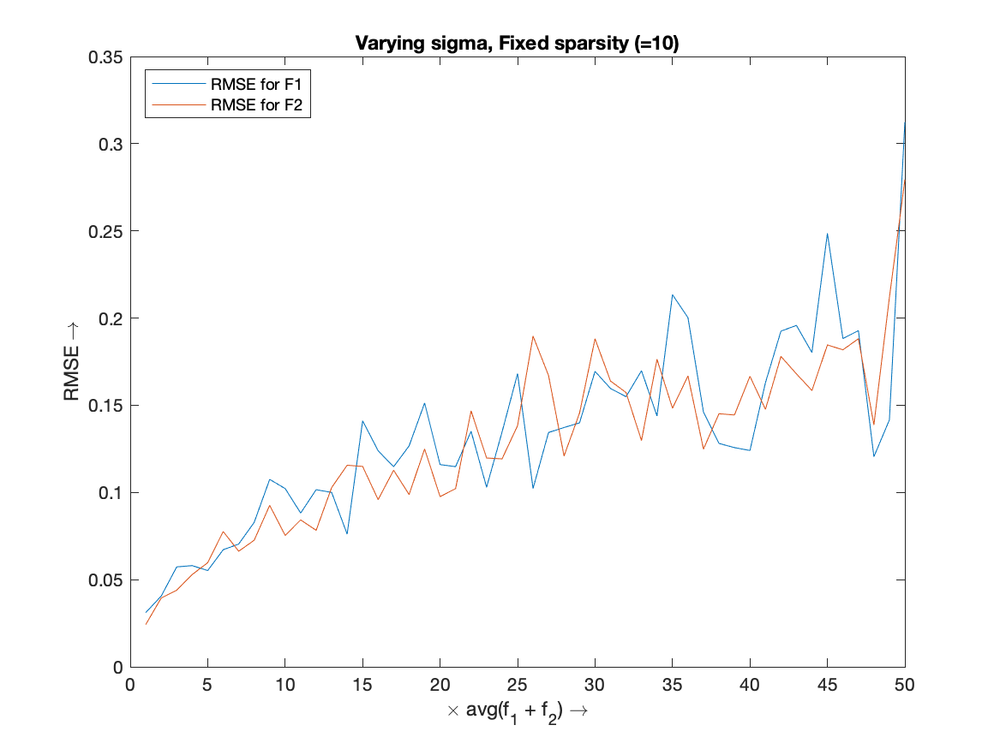
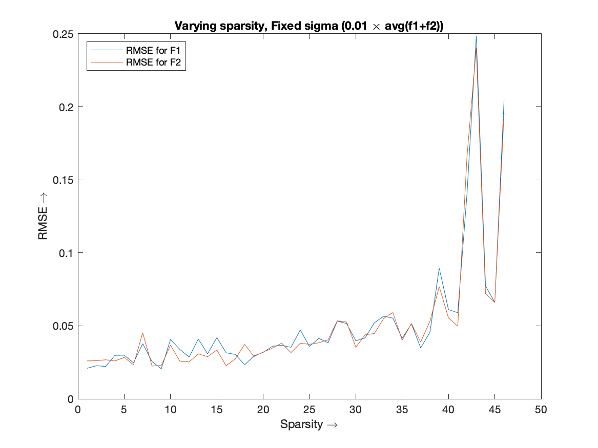
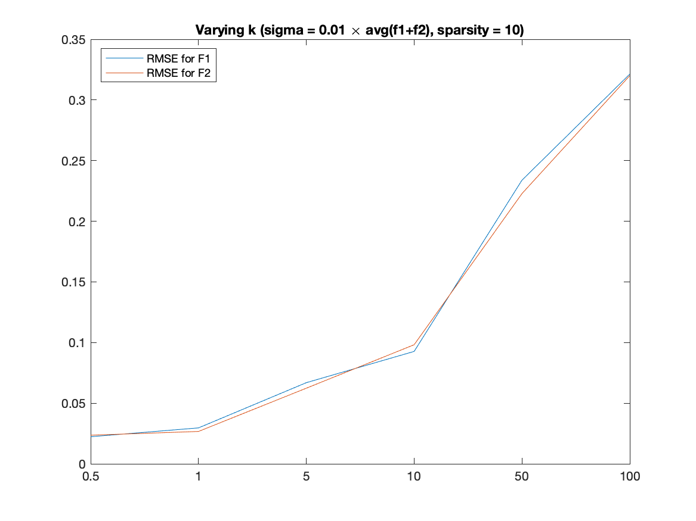
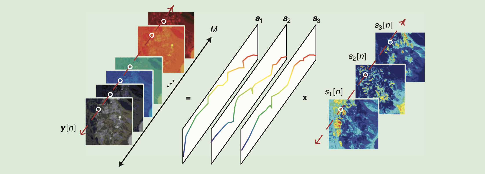

# HW 3 - CS754

#### Sahasra Ranjan - 190050102

#### Rahul Prajapat - 190050095

### Q1

**Technique used for reconstruction:**

-  Computed a larger basis matrix $A = [A1\ A2]$
- Using the $l1\_ls$ solver in MATLAB, reconstructed the sparse signal $f1, f2$ with basis $A1, A2$ respectively.
- Parameter for the solver was selected using hit an trial method for many values. Out of which we selected the $\epsilon=10^{-3}$.

**Varying $\sigma$ and fixed sparsity: **

Here, x-axis has the factor $\tau$. Where $\sigma = \tau \times avg(f_1+f_2)$

RMSE increases overall with the increase in $\sigma$ values of the noise.

**Varying sparsity and fixed $\sigma$**

RMSE increases overall with the increase in sparsity of the signal.

**varying k, fixed $\sigma$ and sparsity**

With the increase in the factor ($norm(f_2)/norm(f_1)$), the RMSE value for smaller signal is higher. And as observed in this log plot, RMSE value if low around 1 and high around $k \ll 1$ and $k \gg 1$.

### Q2

Paper: [CoSaMP: Iterative signal recovery from incomplete and inaccurate samples](https://arxiv.org/abs/0803.2392)

Author: [D. Needell](https://arxiv.org/search/math?searchtype=author&query=Needell%2C+D), [J. A. Tropp](https://arxiv.org/search/math?searchtype=author&query=Tropp%2C+J+A)

Journal reference: Appl. Comput. Harmon. Anal., Vol. 26, pp. 301-321, 2008

#### Algorithm 

-----

**CoSaMP($\Phi, u, s$)**

**Input**: Sampling matrix $\phi$, noisy sample vector $u$, sparsity level $s$.

**Output**: An s-sparse approximation $a$ of the target signal

1. $a^0 \gets 0\\$                                                        // Initial approximation

2. $v \gets u\\$                                                         // Current samples = input samples

3. $k \gets 0\\$

4. **repeat**

   1. $k \gets k + 1$
   2. $y \gets \Phi^*v$ 											// Form signal proxy
   3. $\Omega \gets supp(y_{2s})$ 				                // Identify large components
   4. $T \gets \Omega \cup supp(a^{k-1})$			           // Merge supports
   5. $b|_T \gets \Phi^\dagger_T u$					                    // Signal estimation by least-squares
   6. $b|_{T^c} \gets 0$
   7. $a \gets b_s$												// Prune to obtain next approx
   8. $v \gets u - \Phi a^k$								     // Update current samples

   **until** haling criterion *true*

-----

<u>Def.</u> *quasi-norm*: 
$$
||x||_0 = |supp(x)| = |\{j : x_j \neq 0\}|
$$
<u>Def.</u> 
$$
x|_T = x_i\ \text{if}\ i \in T \ \text{else}\ 0
$$
$x|_T$ Is treated as an element of the vector space $\C^T$. And the restriction $\Phi_T$ of the sampling matrix $\Phi$ is defined as the column sub matrix whose columns are listed in the set $T$.

<u>Def.</u> Pseudo inverse:
$$
A^\dagger = (A^* A)^{-1} A^*
$$

**CoSaMP** uses an approach inspired by the restricted isometry property. The sampling matrix $\bold \Phi$ has restricted isometry constant $\delta_s \ll 1$. For an s-sparse signal $x$, the vector $\bold{y = \Phi^*\Phi x}$ serves as a proxy for the signal because the energy in each set of s components of **y** approximates the energy in the corresponding s components of x. In particular, the largest s entries of the proxy y point toward the largest s entries of the signal x. Since the samples have the form $\bold{u= \Phi x}$, we can obtain the proxy just by applying the matrix $\Phi^*$ to the samples.

-----

**Theorem:** (CoSaMP). *Suppose that $\Phi$ is an $m \times N$ sampling matrix with RIC $\delta_{2s} \leq c$. Let $\bold{u = \Phi x + e}$ be a vector of samples of an arbitrary signal, contaminated with arbitrary noise. For a given precision parameter $\eta$, the algorithm* CoSaMP *produces a 2s-sparse approximation **a** that satisfies*
$$
||\bold x - \bold a||_2 \leq C \cdot \text{max} \bigg \{\eta, \frac{1}{\sqrt {s}} || \bold{x - x_s}||_1 + ||\bold e||_2 \bigg\}
$$
*Where $\bold{x_s}$ is a best s-sparse approximation to $\bold x$. The running time is $\mathcal{O}(\mathscr L \cdot \log(||\bold x||_2/\eta))$, where $\mathscr L$ bound the cost of a matrix-vector multiply with $\bold \Phi$ or* $\bold \Phi^*$ *The working storage use is $\mathcal{O}(N)$*

-----

### Q3

Note: $D_i$ is the $i^{th}$ column of dictionary $D$

- Derivative filter is applied via convolution of an image $I$ with a derivation kernel.

  $\hat I = K \ast I,$ we use vectorized $I$  for our dictionary representation .

  This convolution can be represented by a matrix $A$ as convolution is a linear operation, s.t., $vec(\hat I) = A.vec(I)$ 

  $vec(I) = DS \Rightarrow A.vec(I)=ADS$

  $AD = [AD_1 | AD_2|...|AD_n]$

  $\therefore\hat D = [AD_1 | AD_2|...|AD_n]$

  So our new dictionary $\hat D$ is obtained by applying the same derivative filter on the columns of the old dictionary $D$.

- Rotating an image means re-positioning the cells of that image.

  So a rotated version of a vectorized image $I$ can be computed by multiplying it by a certain matrix, rotated$(I) = \hat I = RI,$ where each row and column in $R$ have at most 1 non-zero element whose value is 1.

  Rotation by $\alpha$ can be denoted as $I_\alpha = R_\alpha I,$ similarly rotation by $\beta$ can be denoted as $I_\beta = R_\beta I$

  $I = DS$

  $I_\alpha = R_\alpha I = R_\alpha DS$

   $R_\alpha D = [R_\alpha D_1 | R_\alpha D_2|...|R_\alpha D_n]$

  $\therefore D^\alpha = [R_\alpha D_1 | R_\alpha D_2|...|R_\alpha D_n]$

  Similarly, $D^\beta = [R_\beta D_1 | R_\beta D_2|...|R_\beta D_n]$

  As some images are rotated by $\alpha$ while some by $\beta,$ we need both $D^\alpha$ and $D^\beta$.

  $\therefore \hat D = [D^\alpha | D^\beta]$

  So our new dictionary $\hat D$ is obtained by column concatenation of two dictionaries which are obtained by rotating each column of the old dictionary $D$ (considering it as an image) by $\alpha$ and by $\beta$ respectively.

- $I_{new}^{i}(x,y)=\alpha(I^i_{old}(x,y))^2+\beta(I^i_{old}(x,y))+\gamma$

  Let the vectorized form of our image be $X$.

  $X=DS$

  $X_i=D^i.S,$ where $D^i$ is the $i^{th}$ row of $D$.

  $X_i^2=(\sum_jD_{ji}S_j)^2$

  $X_i^2=\sum_jD_{ji}^2S_j^2+2\sum_{x,y,x>y}D_{xi}D_{yi}S_xS_y$

  $\therefore$ Dictionary $D^{sq}$ for squared signal:

  ​	$D^{sq}=[D^s|D^q],$ where 

  ​		$D^s=[D_1^2|D_2^2|...|D_n^2],$ $D_i^2$ is the column vector obtained by squaring elements of $D_i$ 

  ​		$D^q=2[D_1D_2|D_1D_3|...|D1D_n|D_2D_3|D_2D_4|...|D_2D_n|...|D_{n-1}D_n],$ 

  ​						$D_iD_j$ is the column vector obtained by element wise product of $D_i$ and $D_j$

  $aX+b = aDS+b$

  $aDS+b=[aD|b\textbf{1}]S^{'},$ $\bf 1$ is the column vector with every element being 1 and $S^{'}$ is $S$ row concatenated with 1.

  $\therefore$ Our new Dictionary $\hat D$ is:

  $\hat D=[\alpha D^{sq}|\beta D|\gamma\textbf{1}]$

- A blur kernel is applied to the image, so as seen in the first part to obtain the new dictionary $\hat D$ we have to apply the same blur kernel to the columns of the old dictionary $D$.

- $I$ is our image on which convolution is to be applied

  $I^{'}=K\ast I, K=\sum_i\alpha_iK_i, K_i$ is the $i^{th}$ kernel in the set 

  $K\ast I=\sum_i\alpha_iK_i\ast I$

  $X$ is the vectorized form of $I$

  $vec(K_i\ast I)=A^i.X,$ for some matrix $A^i$

  $X=DS$

  $A^i.X=A^i.DS$  

  $A^iD=[A^iD_1|A^iD_2|...|A^iD_n]$

  $D^i=A^iD$

  $\sum_i\alpha_iK_i\ast I=\sum_i\alpha_iA^iX=\sum_i\alpha_iA^iDS=\sum_i\alpha_iD^iS$

  $\sum_i\alpha_iD^iS=\sum_iD^i(\alpha_iS)$

  $\therefore vec(I^{'})=\sum_iD^i(\alpha_iS)$

  $\therefore \hat D=[D^1|D^2|...|D^C],$ where $C$ is the cardinality of the set of kernels

  So our new Dictionary $\hat D$ is concatenation of dictionaries each obtained as described in the previous part for each kernel in the set. 

### Q4

- The solution to the following optimization problem:
  $$
  \min_{A_r} ||A-A_r||_F^2 \text{ where rank} (A_r)=r,r\le \min(m,n),A \in \R^{m \times n}
  $$
  is given using SVD of $A$ as follows:
  $$
  A_r = \sum_{i=1}^{r}S_{ii}u_iv_i^t, \text{ where } A= USV^T
  $$

  - This optimization problem occurs in Image Compression.

  - Instead of storing $mn$ intensity values, we store $(n+m+1)r$ intensity values where $r$ is the number of stored singular values (or singular vectors). The remaining m-r singular values (and hence their singular vectors) are effectively set to 0.

  - This is called as storing a low-rank (rank $r$) approximation for an image.

  - SVD gives the best possible rank-$r$ approximation of any matrix.

    

- $$
  R^* = \min_R||A-RB|| \text{ s.t. } R^TR=I \text{ //R is orthonormal}\\
  \min_R||A-RB||_F^2 = \min_A trace((A-RB)^T(A-RB))\\
  = \min_R trace(A^TA-2A^TRB+B^TB)\\
  =\max_R trace(A^TRB)\\
  =\max_R trace(RBA^T) \text{ //trace(FG)=trace(GF)}\\
  \text{--Let }BA^T=Q\text{, SVD of } Q \text{ gives } Q=UDV^T\\
  =\max_R trace(RUDV^T)\\
  =\max_R trace(V^TRUD)\\
  =\max_R trace(Z(R)D) \text{ where } Z(R)=V^TRU\\
  =\max_R\sum_i z_{ii}d_{ii} \le \sum_i d_{ii} \text{ //}Z(R)^TZ(R)=I\\
  \text{The maximum is achieved for Z(R)=I,i.e,}\\
  V^TRU=I \Rightarrow R=VU^T
  $$

  

  - This optimization problem arises in Bases learning using Union of Ortho-normal Bases.

  - We represent a signal in the following way:
    $$
    X=AS+\epsilon\\
    (A,S) = \min_{A,S} ||X-AS||^2+\lambda ||S||_1
    $$

  - A is an over-complete dictionary, which is assumed to be a union of ortho-normal bases, in the form
    $$
    A=[A_1|A_2|...|A_M]\\
    \forall i,1\le i\le M, A_iA_i^T=I
    $$

  - This application of SVD is called orthogonal Procrustes problem.

  

### Q5

<ins>Hyperspectral Unmixing</ins> is a procedure that decomposes the measured pixel spectrum of hyperspectral data into a collection of constituent spectral signals and a set of corresponding fractional abundances.

In general, the linear mixture model (LMM) is recognised as an acceptable model for Hyperspectral Unmixing. The LMM is describes as follows.  Let $y_m[n]$ denote the hyperspectral camera's measurement at spectral band m and pixel n. Let, $y[n] = [y_1[n], y_2[n], \dots , y_M[n]]^T \in \R^M$, where M is the number of spectral bands. The LMM is given by:
$$
y[n] = \Sigma_{i=1}^N \bold a_i s_i + \bold v[n] = \bold As[n] + \bold v[n]
$$
for $n = 1, \dots, L,$ where,

- each $\bold a_i \in \R^M, i=1, \dots, N$ is called an *endmember signature vector*, which contains the spectral components of a specific material (indexed by i) in the scene. 
- $N$ Is the number of endmembers , or material, in the scene. $\bold A = [\bold a_1, \dots, \bold a_N] \in \R^{M \times N}$ Is called the *endmember matrix*. 
- $s_i[n]$ describes the contribution of material $i$ at pixel n. $s[n] = [s_1[n], \dots, s_N[n]] \in \R^N$ Is called the *abundance vector* at pixel n. 
- $L$ Is the number of pixels 
- $\bold v[n] \in \R^M$ is noise.

Non-negative matrix factorisation is posed as a low-rank matrix approximation problem where, given a data matrix $\bold Y \in \R^{M \times L}$, the task is to find a pair of non-negative matrices $\bold A \in \R^{M \times N}, \bold S \in \R^{N \times L}$, with $N < min\{M, L\}$, that solves
$$
min_{A \geq 0, S \geq 0} || \bold Y - \bold A \bold S||_F^2
$$
In blind HU the connection is that the NMD factors obtained, $\bold A$ and $\bold S$, can serve as estimates of the endmembers and abundances. 
$$
\bold A = [\bold a_1, \dots, \bold a_N] \in \R^{M \times N} \\
s[n] = [s_1[n], \dots, s_N[n]] \in \R^N
$$
In the HU equation mentioned above, $y[n], s[n]$  are for a pixel at position n. In the NMF equation $\bold S$ and $\bold Y$ will be concatenated $s[n]$ and $y [n]$. And so we can reframe hyperspectral unmixing problem into non-negative matrix factorisation problem.
$$
min_{A \ge 0, S \in S^L} || \bold Y - \bold A \bold S||_F^2 + \lambda \cdot  g(\bold A) + \mu \cdot h(\bold S)
$$
Where, $\bold S^l = \{\bold S | s[n] \geq \bold 0, \bold 1^T \bold s[n] = 1, 1\leq n \leq L \}$, $g$ and $h$ are regularisers, which vary from one work to another and $\lambda, \mu > 0$ are some constants. 

**MVC-NMF**
$$
min_{A \geq 0, S \in S^L} ||\bold Y - \bold A \bold S||_F^2 + \lambda \cdot (\text{vol}(B))^2
$$
Where, vol($ B$) is the simplex volume corresponding to $\bold A$, in which $b_i = C^\dagger (a_i - d)$ for all $I$ This is essentially a variation of the VolMin formulation.

**ICE**

Iterated constrained endmember (ICE) and sparsity promoting ICE (SPICE) avoid this issue by replacing $(\text{vol}(B))^2$ with a convex surrogate, specifically, $g(\bold A) = \Sigma_{I=1}^{N-1} \Sigma_{j=i+1}^N ||a_i - a_j||_2^2$, which is the sum of differences between vertices.
$$
min_{A \geq 0, S \in S^L} ||\bold Y - \bold A \bold S||_F^2 + \Sigma_{I=1}^{N-1} \Sigma_{j=i+1}^N ||a_i - a_j||_2^2
$$
**Dictionary Learning**

For the abundance regulariser $h$, the design principle usually follows that of sparsity. 
$$
min_{A \geq 0, S \in S^L} ||\bold Y - \bold A \bold S||_F^2 + \mu \cdot ||\bold S||_{1,1}
$$
Where, $||\bold S||_{1,1} = \Sigma_{n=1}^L \Sigma_{I=1}^N |s_i[n]|$. The idea is to learn the dictionary $\bold A$ by joint dictionary and sparse signal optimization. 

**$\bold{L_{1/2}}$-NMF**

Similar to the DL optimisation techniques, $L_{1/2}$-NMF uses a non-convex, but stronger sparsity-promoting regulariser based on the $l_{1/2}$ quasi norm. Apart from sparsity, exploitation of spatial contextual information via TV regularisation may be used.
$$
min_{A \geq 0, S \in S^L} ||\bold Y - \bold A \bold S||_F^2 + \mu \cdot ||\bold S||_{1/2,1/2}^{1/2}
$$

