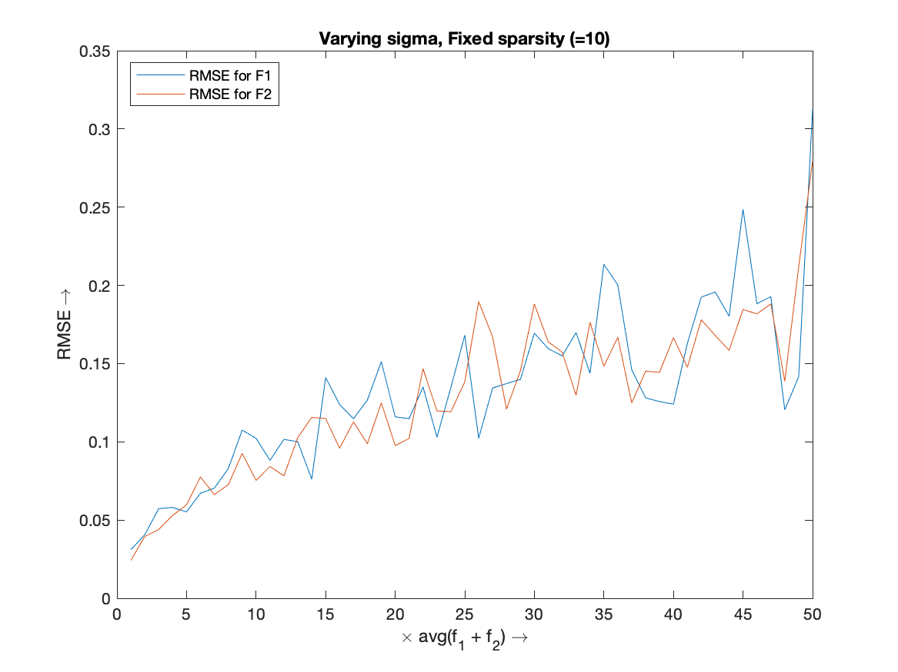
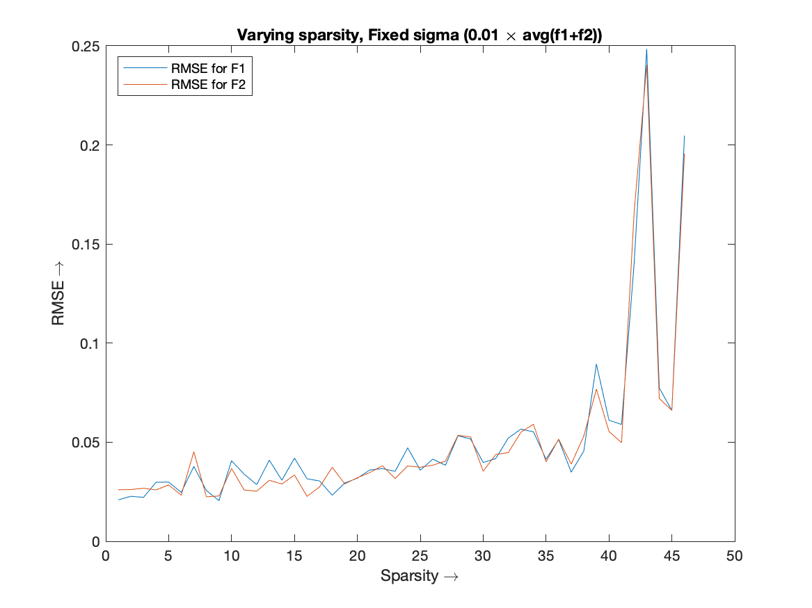
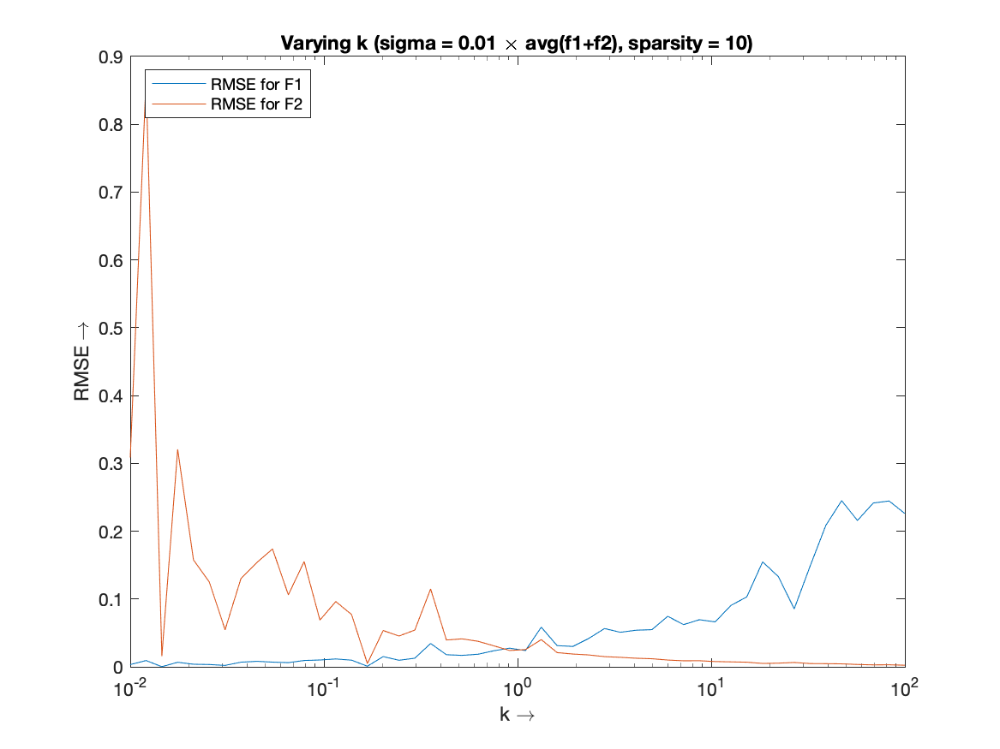
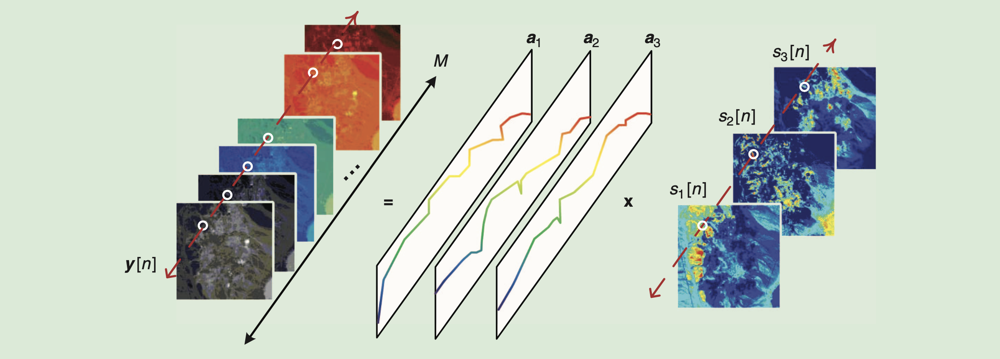

# HW 3 - CS754

#### Sahasra Ranjan - 190050102

#### Rahul Prajapat - 190050095

### Q1

**Technique used for reconstruction:**

-  Computed a larger basis matrix $A = [A1\ A2]$
- Using the $l1\_ls$ solver in MATLAB, reconstructed the sparse signal $f1, f2$ with basis $A1, A2$ respectively.
- Parameter for the solver was selected using hit an trial method for many values. Out of which we selected the $\epsilon=10^{-3}$.

**Varying $\sigma$ and fixed sparsity: **

Here, x-axis has the factor k. Where $\sigma = k \times avg(f_1+f_2)$

**Varying sparsity and fixed $\sigma$**

**varying k, fixed $\sigma$ and sparsity**

### Q2

### Q5

<ins>Hyperspectral Unmixing</ins> is a procedure that decomposes the measured pixel spectrum of hyperspectral data into a collection of constituent spectral signals and a set of corresponding fractional abundances.

In general, the linear mixture model (LMM) is recognised as an acceptable model for Hyperspectral Unmixing. The LMM is describes as follows.  Let $y_m[n]$ denote the hyperspectral camera's measurement at spectral band m and pixel n. Let, $y[n] = [y_1[n], y_2[n], \dots , y_M[n]]^T \in \R^M$, where M is the number of spectral bands. The LMM is given by:
$$
y[n] = \Sigma_{i=1}^N \bold a_i s_i + \bold v[n] = \bold As[n] + \bold v[n]
$$
for $n = 1, \dots, L,$ where,

- each $\bold a_i \in \R^M, i=1, \dots, N$ is called an *endmember signature vector*, which contains the spectral components of a specific material (indexed by i) in the scene. 
- $N$ Is the number of endmembers , or material, in the scene. $\bold A = [\bold a_1, \dots, \bold a_N] \in \R^{M \times N}$ Is called the *endmember matrix*. 
- $s_i[n]$ describes the contribution of material $i$ at pixel n. $s[n] = [s_1[n], \dots, s_N[n]] \in \R^N$ Is called the *abundance vector* at pixel n. 
- $L$ Is the number of pixels 
- $\bold v[n] \in \R^M$ is noise.

Non-negative matrix factorisation is posed as a low-rank matrix approximation problem where, given a data matrix $\bold Y \in \R^{M \times L}$, the task is to find a pair of non-negative matrices $\bold A \in \R^{M \times N}, \bold S \in \R^{N \times L}$, with $N < min\{M, L\}$, that solves
$$
min_{A \geq 0, S \geq 0} || \bold Y - \bold A \bold S||_F^2
$$
In blind HU the connection is that the NMD factors obtained, $\bold A$ and $\bold S$, can serve as estimates of the endmembers and abundances. 
$$
\bold A = [\bold a_1, \dots, \bold a_N] \in \R^{M \times N} \\
s[n] = [s_1[n], \dots, s_N[n]] \in \R^N
$$
In the HU equation mentioned above, $y[n], s[n]$  are for a pixel at position n. In the NMF equation $\bold S$ and $\bold Y$ will be concatenated $s[n]$ and $y [n]$. And so we can reframe hyperspectral unmixing problem into non-negative matrix factorisation problem.
$$
min_{A \ge 0, S \in S^L} || \bold Y - \bold A \bold S||_F^2 + \lambda \cdot  g(\bold A) + \mu \cdot h(\bold S)
$$
Where, $\bold S^l = \{\bold S | s[n] \geq \bold 0, \bold 1^T \bold s[n] = 1, 1\leq n \leq L \}$, $g$ and $h$ are regularisers, which vary from one work to another and $\lambda, \mu > 0$ are some constants. 

**MVC-NMF**
$$
min_{A \geq 0, S \in S^L} ||\bold Y - \bold A \bold S||_F^2 + \lambda \cdot (\text{vol}(B))^2
$$
Where, vol($ B$) is the simplex volume corresponding to $\bold A$, in which $b_i = C^\dagger (a_i - d)$ for all $I$ This is essentially a variation of the VolMin formulation.

**ICE**

Iterated constrained endmember (ICE) and sparsity promoting ICE (SPICE) avoid this issue by replacing $(\text{vol}(B))^2$ with a convex surrogate, specifically, $g(\bold A) = \Sigma_{I=1}^{N-1} \Sigma_{j=i+1}^N ||a_i - a_j||_2^2$, which is the sum of differences between vertices.
$$
min_{A \geq 0, S \in S^L} ||\bold Y - \bold A \bold S||_F^2 + \Sigma_{I=1}^{N-1} \Sigma_{j=i+1}^N ||a_i - a_j||_2^2
$$
**Dictionary Learning**

For the abundance regulariser $h$, the design principle usually follows that of sparsity. 
$$
min_{A \geq 0, S \in S^L} ||\bold Y - \bold A \bold S||_F^2 + \mu \cdot ||\bold S||_{1,1}
$$
Where, $||\bold S||_{1,1} = \Sigma_{n=1}^L \Sigma_{I=1}^N |s_i[n]|$. The idea is to learn the dictionary $\bold A$ by joint dictionary and sparse signal optimization. 

**$\bold{L_{1/2}}$-NMF**

Similar to the DL optimisation techniques, $L_{1/2}$-NMF uses a non-convex, but stronger sparsity-promoting regulariser based on the $l_{1/2}$ quasi norm. Apart from sparsity, exploitation of spatial contextual information via TV regularisation may be used.
$$
min_{A \geq 0, S \in S^L} ||\bold Y - \bold A \bold S||_F^2 + \mu \cdot ||\bold S||_{1/2,1/2}^{1/2}
$$

