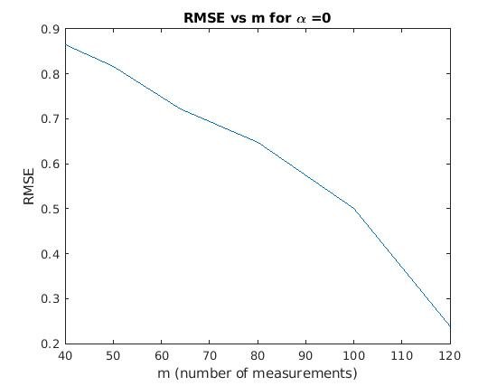
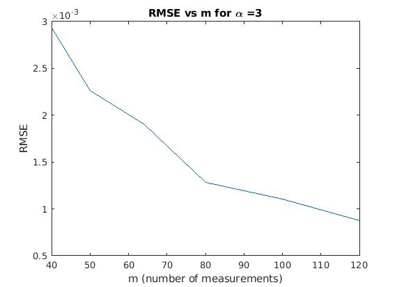

# CS754 HW5

## Rahul Prajapat (190050095)

## Sahasra Ranjan (190050102)

### 1

**(a)** Eq 6 given in the paper:
$$
J_2(I_1) = \Sigma_{i,k}\  \rho(f_{i,k} \cdot I_1) + \rho(f_{i,k} \cdot (I-I_1))
\\ + \lambda \Sigma_{i\in S_1,k}\ \rho(f_{i,k} \cdot I_1 - f_{i,k}\cdot I)
\\ + \lambda \Sigma_{i\in S_2,k}\  \rho(f_{i,k} \cdot I_1)
$$

This is simplified as:
$$
J_3(v) = \Sigma_j \rho(A_{j \to} v - b_j)
$$
Where, $v$ is vectorised form of the Image $I_1$ and vector $b_j$ is either vectorised form of derivative of input image $I$ or $0$.

The matrix $A_j$ represents a block matrix which when multiplied with $v$ gives same result as convolving with the filter $v_{i,k}$. Each row of the matrix $A_{j \to}$ have values of $f_{i,k}$ which on multiplication with $v$ will convolute the given image $v$.

So, the $k$-th element in the block matrix $A_{j \to}$ say $A_{j,k}$​ will **represent** these convolutions/values (converted to appropriate dimensions): 

|                             Term                             | $\bold{A_{j,k}}$ | $\bold{b_{j}}$ |
| :----------------------------------------------------------: | :--------------: | :------------: |
|           $\Sigma_{i,k}\ \rho(f_{i,k} \cdot I_1)$            |    $f_{i,k}$     |      $0$       |
|         $\Sigma_{i,k}\ \rho(f_{i,k} \cdot (I-I_1))$          |   $- f_{i,k}$    | $- f_{i,k} I$  |
| $\Sigma_{i \in S_1,k} \rho(f_{i,k} \cdot I_1 - f_{i,k}\cdot I)$ |    $-f_{i,k}$    | $- f_{i,k} I$  |
|    $\lambda \Sigma_{i\in S_2,k} \rho(f_{i,k} \cdot I_1)$     |    $f_{i,k}$     |      $0$       |

**(b)** 
$$
J_2(I_1) = \Sigma_{i,k}\  \rho(f_{i,k} \cdot I_1) + \rho(f_{i,k} \cdot (I-I_1))
\\ + \lambda \Sigma_{i\in S_1,k}\ \rho(f_{i,k} \cdot I_1 - f_{i,k}\cdot I)
\\ + \lambda \Sigma_{i\in S_2,k}\  \rho(f_{i,k} \cdot I_1)
$$

The **prior** term used in the equation is:
$$
\Sigma_{i,k}\ \rho(f_{i,k} \cdot I_1) + \rho(f_{i,k} \cdot (I-I_1))
$$
And the **likelihood** term used is:
$$
\lambda \Sigma_{i\in S_1,k}\ \rho(f_{i,k} \cdot I_1 - f_{i,k}\cdot I) + \lambda \Sigma_{i\in S_2,k}\  \rho(f_{i,k} \cdot I_1)
$$

The paper uses mixture of two **Laplacian priors** as the prior for the reconstruction problem:
$$
Pe(x) = \frac{\pi_1}{2s_1} e^{-|x|/s_1} + \frac{\pi_1}{2s_2} e^{-|x|/s_2}
$$
The paper uses log likelihood as:
$$
\log Pr(f_{i,k} \cdot I) \approx - \rho (f_{i,k} \cdot I)\\
\rho(x) = \bold{\log (\frac{\pi_1}{2s_1} e^{-|x|/s_1} + \frac{\pi_1}{2s_2} e^{-|x|/s_2})}
$$

**(c)** The paper compares the filter response with various prior functions. Following figure compares it will gaussian and laplacian priors.

The filter response decreases more rapidly from 0 as compared to the gaussian prior function and is highly non-sparse . On the other hand, the mixture of laplacian priors fitted the filter response accurately. Therefore the paper used the prior: 
$$
Pe(x) = \frac{\pi_1}{2s_1} e^{-|x|/s_1} + \frac{\pi_1}{2s_2} e^{-|x|/s_2}
$$

### 2

1. $\mathbf{y}=\mathbf{\Phi x}+\mathbf{\eta}$ 

   $\mathbf{y}\in\R^{m}, \mathbf{\Phi}\in\R^{m\times n}, m \ll n, \mathbf{x}\in\R^{n}, \mathbf{\eta}\sim N(0,\sigma^2\mathbf{I}_{m\times m}), \mathbf{x}\sim N(0,\mathbf{\Sigma_x})$ 

   MAP estimate of **x** given $\mathbf{y,\Phi,\Sigma_x}$ is $\arg \max_x p(\mathbf{y}|\mathbf{x,\Phi})p(\mathbf{x})$
   $$
   p(y|x,\Phi) \propto exp(-1/2 (y-\Phi x)^T(\sigma^2I)^{-1}(y-\Phi x))\\
   = exp(-\frac{(y-\Phi x)^T(y-\Phi x)}{2\sigma^2})
   $$

   $$
   p(x) \propto exp(-1/2x^T\Sigma_x^{-1}x)
   $$

   $$
   \hat x=\arg \max_x p(\mathbf{y}|\mathbf{x,\Phi})p(\mathbf{x})\\
   =\arg \max_x C \times exp(-\frac{(y-\Phi x)^T(y-\Phi x)}{2\sigma^2})\times exp(-1/2x^T\Sigma_x^{-1}x)\\ 
   \text{C is some constant}\\
   =\arg \max_x \log( C \times exp(-\frac{(y-\Phi x)^T(y-\Phi x)}{2\sigma^2})\times exp(-1/2x^T\Sigma_x^{-1}x )\;)\\ 
   = \arg \min_x \frac{(y-\Phi x)^T(y-\Phi x)}{2\sigma^2}+1/2x^T\Sigma_x^{-1}x + \text{constant}\\
   $$

   $$
   \frac{\partial (y-\Phi x)^T(y-\Phi x)}{\partial x} = \frac{\partial y^Ty}{\part x} - \frac{\partial y^T\Phi x}{\part x}-\frac{\partial x^T\Phi^T y}{\part x}+\frac{\part x^T\Phi^T\Phi x}{\part x}\\
   = -2\Phi^Ty + 2\Phi^T\Phi x
   $$

   $$
   \frac{\part x^T\Sigma_x^{-1}x}{\part x}=2\Sigma_x^{-1}x
   $$

   $$
   \frac{\part \frac{(y-\Phi x)^T(y-\Phi x)}{2\sigma^2}+1/2x^T\Sigma_x^{-1}x + \text{constant}}{\part x}=0\\
   \Rightarrow \frac{-2\Phi^Ty + 2\Phi^T\Phi x}{2\sigma^2}+\frac{2\Sigma_x^{-1}x}{2}
   =0\\
   \Rightarrow (\frac{\Phi^T\Phi}{\sigma^2}+\Sigma_x^{-1})x=\frac{\Phi^Ty}{\sigma^2}\\
   \Rightarrow x=(\frac{\Phi^T\Phi}{\sigma^2}+\Sigma_x^{-1})^{-1}\frac{\Phi^Ty}{\sigma^2}
   $$

   Therefore MAP solution $\hat x=(\frac{\Phi^T\Phi}{\sigma^2}+\Sigma_x^{-1})^{-1}\frac{\Phi^Ty}{\sigma^2}$

   

2. 1. $\alpha = 0$

      

   2. $\alpha = 3$

      
   
   3. Observations:
   
      - Both the graphs are decreasing which is consistent with theory and intuition, as more the number of measurements, better the reconstruction.
      - For $\alpha=0$ case all the eigenvalues were 1 making it in-compressible while, for $\alpha = 3$ the eigenvalues are exponentially decreasing making it compressible as it can be approximated as low rank. And the results are aligned with this fact.  
   

### 3

$$
X^* := \arg \min_X ||X||_* \hspace{2cm} s.t. A(X) = b
$$

$X_0$ is a matrix of rank $r$ and $b := A(X)$. (eq 3.1 in the paper)

1. Since $X^*$ is defined to as $\arg \min ||X||_*$ such that $A(X)=b$ and $b = A(X_0)$. It is trivial that $X^* < X_0$ and infact minimum of all such $X$ satisfying $A(X)=b$.

2. $X_0 R_c' = 0$ and $X_0'R_c=0$ so from lemma 2.3, $||X_0 + R_c||_* = ||X_0||_* + ||R_c||_*$ and thus the equality follows.

3. $\forall k \in I_{i+1}, j \in I_i \sigma_k \leq \sigma_j$, due to the definition of the index set $I$ and $SVD$. Now, $3r\times\sigma_k < \Sigma_{j \in I_i} \sigma_j$ as $I_i$ has $3ri - 3r(i-1) = 3r$ elements, which evaluates to $\sigma_k \leq \frac{1}{3r} \Sigma_{j \in I_i} \sigma_j$.

4.  Frobenius norm is defined as:
   $$
   ||R_{i+1}||^2_F = \sqrt{\Sigma_i \sigma_i^2} \leq max(\sigma_i) \leq \frac{1}{3r} \Sigma_{j \in I_i} \sigma_j \hspace{2cm} (\sigma_i \in \sigma_{I_{i+1}}) \\
   \implies ||R_{i+1}||^2_F \leq \frac{1}{3r} \Sigma_{j \in I_i} \sigma_j = \frac{1}{3r} ||R_i||_*^2
   $$

5. $r$ is rank of the matrix, so:
   $$
   ||R_{i+1}||^2_F \leq \frac{1}{3r} ||R_i||^2_*\\
   ||R_{i+1}||_F \leq \frac{1}{\sqrt{3r}} ||R_i||_*\\
   \Sigma_{j \geq 2} ||R_{i+1}||_F \leq \Sigma_{j \geq 1} \frac{1}{\sqrt{3r}} ||R_i||_*
   $$

6.  Using lemma 3.4, we get $||R_0||_* \geq ||R_c||_*$. Therefore,
   $$
   \frac{1}{\sqrt{3r}} ||R_c||_* \leq \frac{1}{\sqrt{3r}} ||R_0||_*
   $$

7.  According to equation 2.1 and the fact that rank($R_0$) $\leq 2r$, we get:

$$
||X||_* \leq \sqrt r ||X||_F\\
\implies \frac{1}{\sqrt {3r}} ||R_0||_* \leq \frac{\sqrt{2r}}{\sqrt{3r}} ||R_0||_F
$$

8. $R_1$ Has rank at-most $3r$ and $R_0$ has rank at-most $2r$ and we know that rank of sum of two matrices is at most sum of rank of the matrices ([ref.](https://math.stackexchange.com/questions/853279/show-that-the-rank-of-ab-is-no-more-than-the-sum-of-the-ranks-of-a-and-b)), so rank($R_0 + R_1$) $\leq 5r$.

9. $R=R_0 + R_c$, and $R_c = \Sigma_{i\geq1} R_i$. Now by triangle inequality,
   $$
   ||A((R_0+R_1) + (\Sigma_{i\geq2} R_i))|| \geq ||A(R_0 + R_1)|| - \Sigma_{j \geq 2}||A(R_j)||
   $$

10.  By the definition 3.1, $(1-\delta_r(A))||X||_F \leq ||A(X)|| \leq (1+\delta_r(A))||X||_F$. Using this for the given inequality, we get: 

$$
||A(R_0 + R_1)|| \geq (1-\delta_{5r})||R_0+R_1||_F\\
\Sigma_{j \geq 2}||A(R_j)|| \geq (1+\delta_{3r}) \Sigma_{j \geq 2} ||R_j||_F\\
$$

$$
or, 
||A(R_0 + R_1)|| + \Sigma_{j \geq 2}||A(R_j)|| \geq \\(1-\delta_{5r})||R_0+R_1||_F
+ (1+\delta_{3r}) \Sigma_{j \geq 2} ||R_j||_F\\
$$

11. As mentioned in the section "Restricted Isometry and Recovery of Low-Rank Matrices", equation 3.1: $b = A(X_0)$ and $A(X^*) = b$, we get $A(R) = A(X^*-X_0) = 0$.
12. $\delta_{3r} \leq \delta_{5r}$, and $\delta_{5r} < 1/10$. We get:

$$
9 \delta_{3r} + 11 \delta_{5r} < 20/10 = 2
$$

### 4

1. If the singular vectors of a matrix **M** are highly concentrated, then **M** could very well be in the null-space of the sampling operator. For instance consider the rank-2 symmetric matrix **M** given by
   $$
   \mathbf{M}=\sum_{k=1}^{2}\sigma_k \mathbf{u}_k\mathbf{u}_k^*\\
   \mathbf{u}_1 = (e_1+e_2)/\sqrt{2}\\
   \mathbf{u}_2 = (e_1-e_2)/\sqrt{2}
   $$
   where the singular values are arbitrary. Then this matrix vanishes everywhere except in the top-left $2 \times 2$ corner and one would basically need to see all the entries in **M** to be able to recover this matrix exactly by any method whatsoever. Hence, the singular vectors need to be sufficiently spread, that is, incoherent with the canonical basis, in order to minimize the number of observations needed to recover a low-rank matrix.

2. The column and row spaces of **M** should be incoherent with the basis ($\mathbf{f}_i$) and ($\mathbf{g}_i$) respectively. (Not canonical basis and not entire **M**)

### 5

1. **[A Unified Approach to Salient Object Detection via Low Rank Matrix Recovery](https://ieeexplore.ieee.org/stamp/stamp.jsp?tp=&arnumber=6247758)**

   [2012 IEEE Conference on Computer Vision and Pattern Recognition](https://ieeexplore.ieee.org/xpl/conhome/6235193/proceeding)

   Conference Location: Providence, RI, USA

2. A **salient feature** is a strong or dominant **characteristic**, tone, or theme something has. Salient object detection is not a pure low-level, bottom-up process. Higher-level knowledge is important even for
   task-independent image saliency.

   Not all unique regions are salient, and a small region with high local contrast might be considered as meaningless noise by the human. To differentiate real salient regions from other unique/high-contrast
   parts, priors from higher-level knowledge need to be integrated.

   The paper propose a unified model to integrate bottom-up, lower-level features and top-down, higher-level priors for salient object detection. An image is represented as a low-rank matrix plus sparse noises in a learned feature space, where the low-rank matrix explains the non-salient regions (or background), and the sparse noises indicate the
   salient regions.

3.  RPCA is used to solve the problem.

   - Given an image, visual features are extracted and stacked to form a feature vector, which captures colour, edge and texture that are most common low-level visual features.
   - Image segmentation is performed based on the extracted features by mean-shift clustering.
   - Feature Matrix representation is formed by stacking Feature vectors of each segment.
   - The decomposition of a learned linear transformation over Feature matrix, with integrated higher-level prior, into Low rank matrix, representing background, and sparse matrix, representing the salient regions, is done using Robust PCA.

   Objective function : $O(\mathbf{L},\mathbf{S}) = ||\mathbf{L}||_*+\lambda||\mathbf{S}||_1$

   Optimization : $(\mathbf{L}^*,\mathbf{S}^*)=\arg \min_{\mathbf{L,S}}O(\mathbf{L},\mathbf{S}) \,\, s.t. \,\, \mathbf{TFP}=\mathbf{L}+\mathbf{S}$

   where $||\mathbf{L}||_*$ is the nuclear norm of $\mathbf{L}$ and $||\;.\;||_1$ indicates $l_1$-norm.

   - The image is decomposed into segments $\{B_i\}_{i=1,...,N}$ where $N$ is the number of segments.

   - For each $B_i$ , the feature vector of its cluster center, i.e., the mean of the features in this segment is used as it's feature representation $f_i$.

   - Feature Matrix representation $\mathbf{F}$ is obtained by stacking $f_i$'s.

     $\mathbf{F}=[f_1,f_2,...,f_N], \mathbf{F}\in\R^{D\times N},$ where $D$ is the dimension of feature vector.

   - $\mathbf{L}$ is the low-rank matrix corresponding to the background.

   - $\mathbf{S}$ is a sparse matrix representing the salient regions.

   - $\mathbf{T}$ is a learned linear transformation on the original feature space. It is learned using the method described in the paper's section **3.3**.

   - $\mathbf{P}$ is a diagonal matrix representing prior probability for each segment.

   The $l_1$ -norm of each column $S_i$ in $\mathbf{S}$ is used to measure the saliency of corresponding segments. If $∥S_i∥_1$ is larger, the image region of the $i^{th}$ segment $B_i$ is assigned a higher value. A saliency map is then accordingly generated and normalized to be a gray-scale image.

