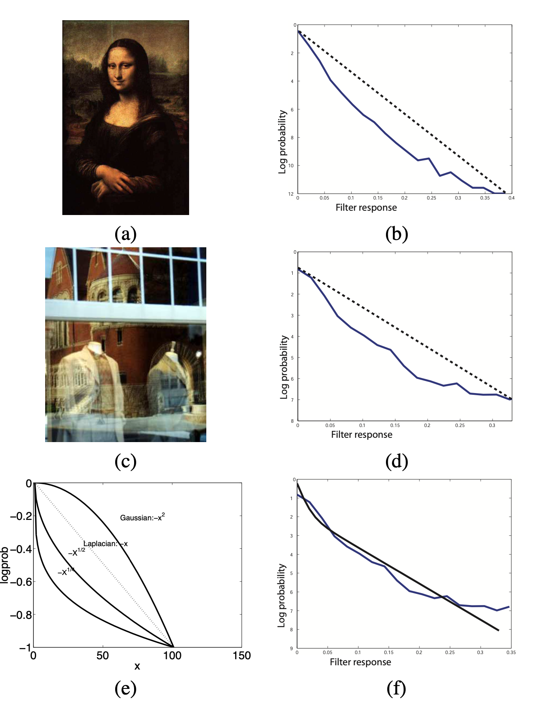

### 1

**(a)** Eq 6 given in the paper:
$$
J_2(I_1) = \Sigma_{i,k}\  \rho(f_{i,k} \cdot I_1) + \rho(f_{i,k} \cdot (I-I_1))
\\ + \lambda \Sigma_{i\in S_1,k}\ \rho(f_{i,k} \cdot I_1 - f_{i,k}\cdot I)
\\ + \lambda \Sigma_{i\in S_2,k}\  \rho(f_{i,k} \cdot I_1)
$$

This is simplified as:
$$
J_3(v) = \Sigma_j \rho(A_{j \to} v - b_j)
$$
Where, $v$ is vectorised form of the Image $I_1$ and vector $b_j$ is either vectorised form of derivative of input image $I$ or $0$.

The matrix $A_j$ represents a block matrix which when multiplied with $v$ gives same result as convolving with the filter $v_{i,k}$. Each row of the matrix $A_{j \to}$ have values of $f_{i,k}$ which on multiplication with $v$ will convolute the given image $v$.

So, the $k$-th element in the block matrix $A_{j \to}$ say $A_{j,k}$​ will **represent** these convolutions/values (converted to appropriate dimensions): 

|                             Term                             | $\bold{A_{j,k}}$ | $\bold{b_{j}}$ |
| :----------------------------------------------------------: | :--------------: | :------------: |
|           $\Sigma_{i,k}\ \rho(f_{i,k} \cdot I_1)$            |    $f_{i,k}$     |      $0$       |
|         $\Sigma_{i,k}\ \rho(f_{i,k} \cdot (I-I_1))$          |   $- f_{i,k}$    | $- f_{i,k} I$  |
| $\Sigma_{i \in S_1,k} \rho(f_{i,k} \cdot I_1 - f_{i,k}\cdot I)$ |    $-f_{i,k}$    | $- f_{i,k} I$  |
|    $\lambda \Sigma_{i\in S_2,k} \rho(f_{i,k} \cdot I_1)$     |    $f_{i,k}$     |      $0$       |

**(b)** 
$$
J_2(I_1) = \Sigma_{i,k}\  \rho(f_{i,k} \cdot I_1) + \rho(f_{i,k} \cdot (I-I_1))
\\ + \lambda \Sigma_{i\in S_1,k}\ \rho(f_{i,k} \cdot I_1 - f_{i,k}\cdot I)
\\ + \lambda \Sigma_{i\in S_2,k}\  \rho(f_{i,k} \cdot I_1)
$$

The **prior** term used in the equation is:
$$
\Sigma_{i,k}\ \rho(f_{i,k} \cdot I_1) + \rho(f_{i,k} \cdot (I-I_1))
$$
And the **likelihood** term used is:
$$
\lambda \Sigma_{i\in S_1,k}\ \rho(f_{i,k} \cdot I_1 - f_{i,k}\cdot I) + \lambda \Sigma_{i\in S_2,k}\  \rho(f_{i,k} \cdot I_1)
$$

The paper uses mixture of two **Laplacian priors** as the prior for the reconstruction problem:
$$
Pe(x) = \frac{\pi_1}{2s_1} e^{-|x|/s_1} + \frac{\pi_1}{2s_2} e^{-|x|/s_2}
$$
The paper uses log likelihood as:
$$
\log Pr(f_{i,k} \cdot I) \approx - \rho (f_{i,k} \cdot I)\\
\rho(x) = \bold{\log (\frac{\pi_1}{2s_1} e^{-|x|/s_1} + \frac{\pi_1}{2s_2} e^{-|x|/s_2})}
$$

**(c)** The paper compares the filter response with various prior functions. Following figure compares it will gaussian and laplacian priors.

The filter response decreases more rapidly from 0 as compared to the gaussian prior function and is highly non-sparse . On the other hand, the mixture of laplacian priors fitted the filter response accurately. Therefore the paper used the prior: 
$$
Pe(x) = \frac{\pi_1}{2s_1} e^{-|x|/s_1} + \frac{\pi_1}{2s_2} e^{-|x|/s_2}
$$

### 3

$$
X^* := \arg \min_X ||X||_* \hspace{2cm} s.t. A(X) = b
$$

$X_0$ is a matrix of rank $r$ and $b := A(X)$. (eq 3.1 in the paper)

1. Since $X^*$ is defined to as $\arg \min ||X||_*$ such that $A(X)=b$ and $b = A(X_0)$. It is trivial that $X^* < X_0$ and infact minimum of all such $X$ satisfying $A(X)=b$.

2. $X_0 R_c' = 0$ and $X_0'R_c=0$ so from lemma 2.3, $||X_0 + R_c||_* = ||X_0||_* + ||R_c||_*$ and thus the equality follows.

3. $\forall k \in I_{i+1}, j \in I_i \sigma_k \leq \sigma_j$, due to the definition of the index set $I$ and $SVD$. Now, $3r\times\sigma_k < \Sigma_{j \in I_i} \sigma_j$ as $I_i$ has $3ri - 3r(i-1) = 3r$ elements, which evaluates to $\sigma_k \leq \frac{1}{3r} \Sigma_{j \in I_i} \sigma_j$.

4.  Frobenius norm is defined as:
   $$
   ||R_{i+1}||^2_F = \sqrt{\Sigma_i \sigma_i^2} \leq max(\sigma_i) \leq \frac{1}{3r} \Sigma_{j \in I_i} \sigma_j \hspace{2cm} (\sigma_i \in \sigma_{I_{i+1}}) \\
   \implies ||R_{i+1}||^2_F \leq \frac{1}{3r} \Sigma_{j \in I_i} \sigma_j = \frac{1}{3r} ||R_i||_*^2
   $$

5. $r$ is rank of the matrix, so:
   $$
   ||R_{i+1}||^2_F \leq \frac{1}{3r} ||R_i||^2_*\\
   ||R_{i+1}||_F \leq \frac{1}{\sqrt{3r}} ||R_i||_*\\
   \Sigma_{j \geq 2} ||R_{i+1}||_F \leq \Sigma_{j \geq 1} \frac{1}{\sqrt{3r}} ||R_i||_*
   $$

6.  Using lemma 3.4, we get $||R_0||_* \geq ||R_c||_*$. Therefore,
   $$
   \frac{1}{\sqrt{3r}} ||R_c||_* \leq \frac{1}{\sqrt{3r}} ||R_0||_*
   $$

7.  According to equation 2.1 and the fact that rank($R_0$) $\leq 2r$, we get:

$$
||X||_* \leq \sqrt r ||X||_F\\
\implies \frac{1}{\sqrt {3r}} ||R_0||_* \leq \frac{\sqrt{2r}}{\sqrt{3r}} ||R_0||_F
$$

8. $R_1$ Has rank at-most $3r$ and $R_0$ has rank at-most $2r$ and we know that rank of sum of two matrices is at most sum of rank of the matrices ([ref.](https://math.stackexchange.com/questions/853279/show-that-the-rank-of-ab-is-no-more-than-the-sum-of-the-ranks-of-a-and-b)), so rank($R_0 + R_1$) $\leq 5r$.

9. $R=R_0 + R_c$, and $R_c = \Sigma_{i\geq1} R_i$. Now by triangle inequality,
   $$
   ||A((R_0+R_1) + (\Sigma_{i\geq2} R_i))|| \geq ||A(R_0 + R_1)|| - \Sigma_{j \geq 2}||A(R_j)||
   $$

10.  By the definition 3.1, $(1-\delta_r(A))||X||_F \leq ||A(X)|| \leq (1+\delta_r(A))||X||_F$. Using this for the given inequality, we get: 

$$
||A(R_0 + R_1)|| \geq (1-\delta_{5r})||R_0+R_1||_F\\
\Sigma_{j \geq 2}||A(R_j)|| \geq (1+\delta_{3r}) \Sigma_{j \geq 2} ||R_j||_F\\
$$

$$
or, 
||A(R_0 + R_1)|| + \Sigma_{j \geq 2}||A(R_j)|| \geq \\(1-\delta_{5r})||R_0+R_1||_F
+ (1+\delta_{3r}) \Sigma_{j \geq 2} ||R_j||_F\\
$$

11. As mentioned in the section "Restricted Isometry and Recovery of Low-Rank Matrices", equation 3.1: $b = A(X_0)$ and $A(X^*) = b$, we get $A(R) = A(X^*-X_0) = 0$.
12. $\delta_{3r} \leq \delta_{5r}$, and $\delta_{5r} < 1/10$. We get:

$$
9 \delta_{3r} + 11 \delta_{5r} < 20/10 = 2
$$

